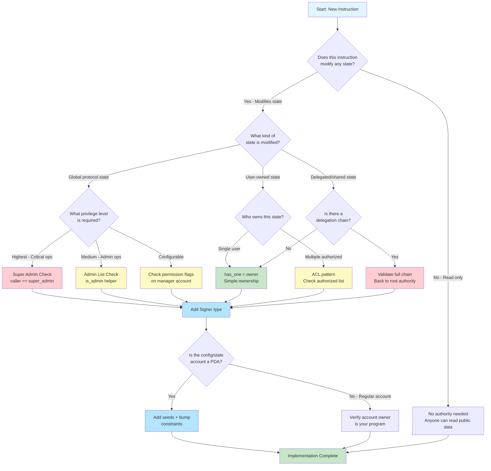
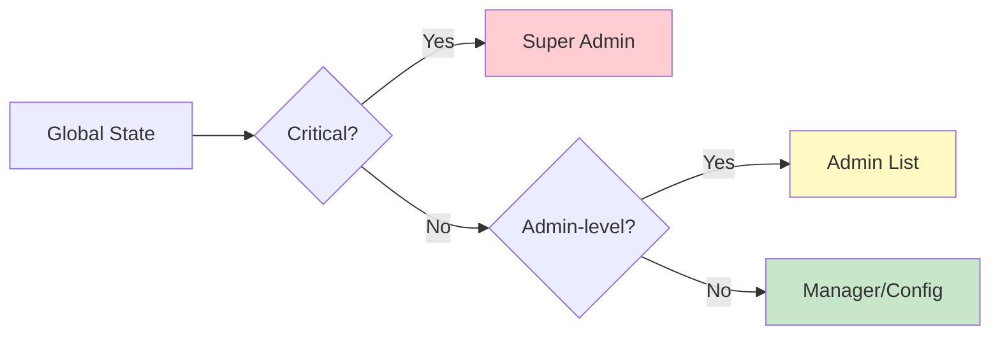
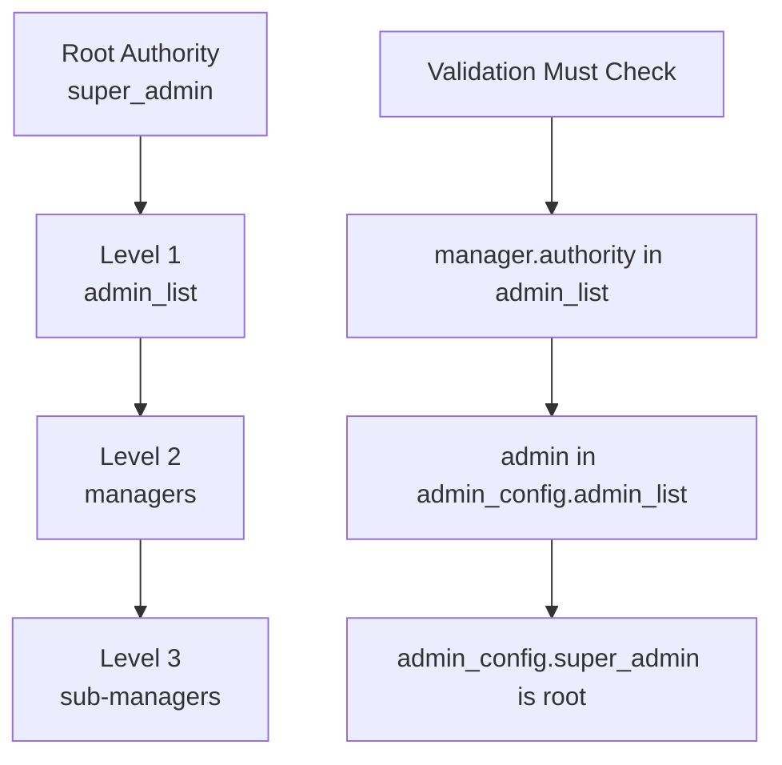
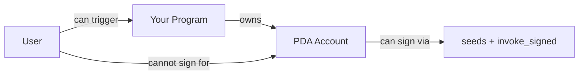

# Authority Check Decision Tree

## Overview

When designing a new instruction, determining the correct authority checks can be complex. This decision tree provides a systematic approach to ensure you implement appropriate validation for every operation.

Use this guide when:
- Designing new program instructions
- Reviewing existing code for security gaps
- Auditing third-party programs

## Main Decision Tree



**Text description for accessibility:**

The decision tree starts with asking if the instruction modifies state. Read-only operations need no authority. State-modifying operations branch based on whether they affect global protocol state, user-owned state, or delegated/shared state.

For global protocol state: highest privilege (super_admin check), medium privilege (admin list check), or configurable (permission flags).

For user-owned state: single user uses has_one, multiple authorized users use ACL pattern.

For delegated state: validate the full authority chain back to root.

All paths that modify state require Signer type. Then check if the account is a PDA (add seeds+bump) or regular account (verify program ownership).

---

## Decision Node Details

### Node 1: Does This Instruction Modify State?

**Question:** Will this instruction write to any account data?

| Answer | Action |
|--------|--------|
| No | No authority checks needed - anyone can read public Solana data |
| Yes | Continue to determine what type of modification |

**Examples:**
- Read-only: Fetching account data, calculating values
- Modifies state: Transferring tokens, updating config, creating accounts

---

### Node 2: What Kind of State Is Modified?

**Categories:**

| Category | Description | Examples |
|----------|-------------|----------|
| Global protocol state | Singleton accounts affecting all users | Fee config, pause state, admin list |
| User-owned state | Accounts belonging to a specific user | User profile, user vault, user NFT |
| Delegated/shared state | Accounts with complex ownership | Multi-sig, DAO treasury, delegated tokens |

---

### Node 3: What Privilege Level for Global State?



**Text description:** Global state modifications are categorized by criticality. Critical operations require super_admin. Standard admin operations require admin list membership. Lower-level configurable operations can be delegated to managers.

**Pattern 02 Example:**

| Operation | Level | Why |
|-----------|-------|-----|
| Pause protocol | Super Admin | Can halt entire system |
| Add/remove admin | Super Admin | Controls who has power |
| Update fees | Admin | Affects economics but recoverable |
| Create manager | Admin | Delegates limited power |

---

### Node 4: User-Owned State - Who Owns It?

For accounts that belong to individual users:

**Single Owner Pattern:**

```rust
// SECURITY: has_one validates owner field matches signer
#[derive(Accounts)]
pub struct UpdateProfile<'info> {
    #[account(
        mut,
        has_one = owner @ ErrorCode::NotOwner
    )]
    pub profile: Account<'info, UserProfile>,

    pub owner: Signer<'info>,
}
```

**Multiple Authorized Users (ACL Pattern):**

```rust
// SECURITY: Custom constraint for list-based authorization
#[derive(Accounts)]
pub struct CollaborativeEdit<'info> {
    #[account(
        mut,
        constraint = document.can_edit(editor.key) @ ErrorCode::NotAuthorized
    )]
    pub document: Account<'info, SharedDocument>,

    pub editor: Signer<'info>,
}
```

---

### Node 5: Delegated/Shared State - Authority Chain

When permissions are delegated through multiple levels:



**Text description:** Authority chains flow from root (super_admin) through levels (admin_list, managers, sub-managers). Validation must verify each link: manager's authority is in admin_list, admin is in admin_config, and admin_config has valid super_admin.

**Implementation:**

```rust
#[derive(Accounts)]
pub struct ManagerAction<'info> {
    // SECURITY: Validate admin_config is legitimate PDA
    #[account(
        seeds = [b"admin_config"],
        bump = admin_config.bump,
    )]
    pub admin_config: Account<'info, AdminConfig>,

    // SECURITY: Validate manager's authority is in admin_list
    #[account(
        seeds = [b"manager", manager_account.manager.as_ref()],
        bump = manager_account.bump,
        constraint = is_admin(
            &admin_config.admin_list,
            admin_config.admin_count,
            &manager_account.authority
        ) @ ErrorCode::InvalidAuthorityChain,
        constraint = manager_account.is_active @ ErrorCode::ManagerNotActive
    )]
    pub manager_account: Account<'info, ManagerAccount>,

    // SECURITY: Caller must be the manager
    #[account(
        constraint = caller.key() == manager_account.manager @ ErrorCode::NotManager
    )]
    pub caller: Signer<'info>,
}
```

---

### Node 6: Always Add Signer

**Every account that authorizes an action must be `Signer<'info>`.**

| Account Role | Use Signer? | Why |
|--------------|-------------|-----|
| Caller/authority | Yes | Proves identity |
| Data account being modified | No | Account itself doesn't sign |
| New account being created | No | Doesn't exist yet |
| Reference account (read-only) | No | Only providing data |
| Payer for account creation | Yes | Authorizes spending lamports |

---

### Node 7: PDA vs Regular Account

**If the account is a PDA (Program Derived Address):**

```rust
// SECURITY: Seeds constraint prevents account substitution
#[account(
    mut,
    seeds = [b"admin_config"],
    bump = admin_config.bump
)]
pub admin_config: Account<'info, AdminConfig>,
```

**If the account is a regular account:**

```rust
// SECURITY: Verify your program owns this account
#[account(
    mut,
    constraint = data_account.to_account_info().owner == &crate::ID
        @ ErrorCode::InvalidAccountOwner
)]
pub data_account: Account<'info, DataAccount>,
```

---

## Quick-Reference Checklist

Use this checklist for every instruction you write or review:

### Identity Verification

- [ ] Are all authority accounts marked as `Signer<'info>`?
- [ ] Is there anyone who shouldn't be able to call this who could?

### Relationship Validation

- [ ] For user-owned accounts: Is there a `has_one` or equivalent constraint?
- [ ] For global state: Is caller validated against stored authority?
- [ ] For delegated actions: Is the full authority chain validated?

### Account Integrity

- [ ] For PDAs: Are `seeds` and `bump` constraints present?
- [ ] For regular accounts: Is program ownership verified?
- [ ] Are all accounts validated against substitution attacks?

### Error Handling

- [ ] Do constraints use descriptive custom errors?
- [ ] Are error messages clear about what failed?

### Edge Cases

- [ ] What happens if an account is closed during execution?
- [ ] What happens if authority is transferred mid-operation?
- [ ] Can a re-initialization attack occur?

---

## Decision Examples

### Example 1: Fee Update Instruction

**Decision path:**

1. Modifies state? → Yes (changes fee_basis_points)
2. What kind? → Global protocol state
3. Privilege level? → Medium (admin can modify)
4. Signer? → Yes
5. PDA? → Yes (admin_config)

**Result:**

```rust
#[derive(Accounts)]
pub struct UpdateFee<'info> {
    #[account(
        mut,
        seeds = [b"admin_config"],
        bump = admin_config.bump,
        constraint = is_admin(&admin_config.admin_list, admin_config.admin_count, caller.key)
            @ ErrorCode::NotAdmin
    )]
    pub admin_config: Account<'info, AdminConfig>,

    pub caller: Signer<'info>,
}
```

### Example 2: User Profile Update

**Decision path:**

1. Modifies state? → Yes (updates profile data)
2. What kind? → User-owned state
3. Who owns? → Single user
4. Signer? → Yes
5. PDA? → Yes (user profile PDA)

**Result:**

```rust
#[derive(Accounts)]
pub struct UpdateProfile<'info> {
    #[account(
        mut,
        seeds = [b"profile", owner.key().as_ref()],
        bump = profile.bump,
        has_one = owner @ ErrorCode::NotOwner
    )]
    pub profile: Account<'info, UserProfile>,

    pub owner: Signer<'info>,
}
```

### Example 3: Manager Creating Sub-Manager

**Decision path:**

1. Modifies state? → Yes (creates new account)
2. What kind? → Delegated state
3. Delegation chain? → Yes (manager → admin → super_admin)
4. Signer? → Yes (manager)
5. PDA? → Yes (manager accounts)

**Result:**

```rust
#[derive(Accounts)]
pub struct CreateSubManager<'info> {
    // Root authority validation
    #[account(
        seeds = [b"admin_config"],
        bump = admin_config.bump,
    )]
    pub admin_config: Account<'info, AdminConfig>,

    // Manager authority chain validation
    #[account(
        seeds = [b"manager", manager_account.manager.as_ref()],
        bump = manager_account.bump,
        constraint = is_admin(&admin_config.admin_list, admin_config.admin_count, &manager_account.authority)
            @ ErrorCode::InvalidAuthorityChain,
        constraint = manager_account.is_active @ ErrorCode::ManagerNotActive,
        constraint = manager_account.can_create_sub_managers @ ErrorCode::InsufficientPermission
    )]
    pub manager_account: Account<'info, ManagerAccount>,

    // New sub-manager account
    #[account(
        init,
        payer = payer,
        space = SubManagerAccount::ACCOUNT_SIZE,
        seeds = [b"sub_manager", sub_manager.key().as_ref()],
        bump
    )]
    pub sub_manager_account: Account<'info, SubManagerAccount>,

    pub manager: Signer<'info>,

    /// CHECK: New sub-manager pubkey
    pub sub_manager: UncheckedAccount<'info>,

    #[account(mut)]
    pub payer: Signer<'info>,

    pub system_program: Program<'info, System>,
}
```

---

## PDA Authority Pattern

A special case: when the PDA itself is the authority (program-controlled accounts).



**Text description:** Your program owns PDA accounts. The PDA can "sign" for CPI calls using seeds and invoke_signed. Users cannot directly sign for PDAs but can trigger your program to do so.

**Example: PDA as token authority**

```rust
pub fn transfer_from_vault(ctx: Context<TransferFromVault>, amount: u64) -> Result<()> {
    // SECURITY: Validate user is authorized to trigger this
    require!(
        ctx.accounts.user.key() == ctx.accounts.vault_config.authorized_user,
        ErrorCode::Unauthorized
    );

    // PDA signs for the transfer
    let seeds = &[
        b"vault",
        ctx.accounts.vault_config.to_account_info().key.as_ref(),
        &[ctx.accounts.vault_config.bump],
    ];
    let signer_seeds = &[&seeds[..]];

    // Transfer using PDA authority
    token::transfer(
        CpiContext::new_with_signer(
            ctx.accounts.token_program.to_account_info(),
            Transfer {
                from: ctx.accounts.vault.to_account_info(),
                to: ctx.accounts.destination.to_account_info(),
                authority: ctx.accounts.vault_pda.to_account_info(),
            },
            signer_seeds,
        ),
        amount,
    )?;

    Ok(())
}
```

---

## Summary

The decision tree ensures you consider:

1. **Whether authority is needed** (state modification?)
2. **What type of authority** (global, user, delegated)
3. **What level of authority** (super_admin, admin, manager)
4. **How to verify identity** (Signer type)
5. **How to validate relationships** (has_one, constraints)
6. **How to prevent substitution** (PDA seeds)

Following this systematic approach prevents the authority check vulnerabilities demonstrated in Pattern 02's vulnerable program.

## Next Section

Continue to [Common Patterns](./common-patterns.md) for detailed implementations of authority patterns you can use in your programs.
