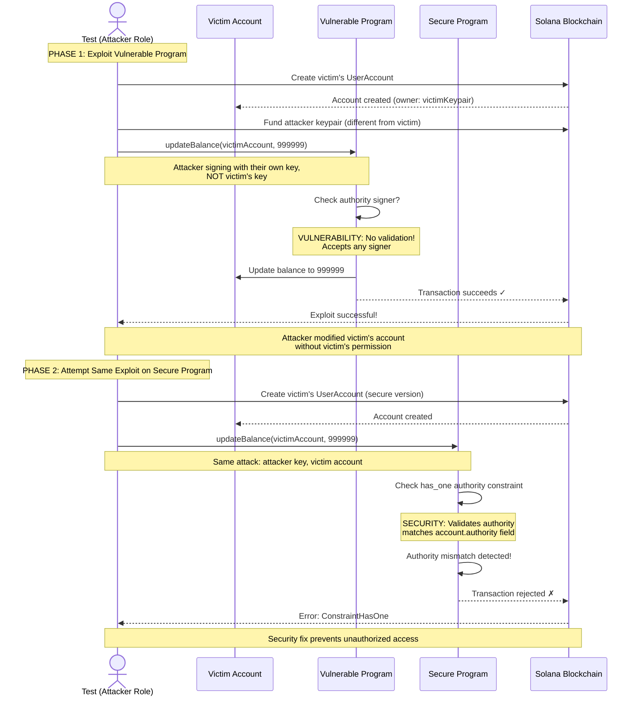

# Pattern 01: Missing Account Validation

A comprehensive educational guide to understanding, identifying, and preventing missing account validation vulnerabilities in Solana programs.

## Table of Contents

- [Overview](#overview)
- [Vulnerability Description](#vulnerability-description)
- [Solana Account Model](#solana-account-model)
- [Real-World Incidents](#real-world-incidents)
- [Attack Scenario Walkthrough](#attack-scenario-walkthrough)
- [Remediation Guide](#remediation-guide)
- [Anchor Patterns](#anchor-patterns)
- [Key Takeaways](#key-takeaways)
- [Running the Demo](#running-the-demo)
- [Related Patterns](#related-patterns)
- [References](#references)

---

## Overview

Missing account validation is one of the most common and dangerous vulnerability classes in Solana programs. When a program fails to verify that the accounts passed to an instruction are legitimate and authorized, attackers can substitute their own accounts or call instructions without proper authorization.

This pattern demonstrates:

1. **The Vulnerability**: A program that accepts any account without validation
2. **The Exploit**: How attackers leverage missing checks to modify state
3. **The Fix**: Proper Anchor constraints that prevent unauthorized access

**Learning Objectives:**

After studying this pattern, you will understand:

- Why every instruction must verify account signers
- How Solana's account ownership model affects security
- How to use Anchor constraints (`Signer<'info>`, `has_one`, `constraint`) to enforce validation
- The difference between vulnerable and secure implementation patterns

---

## Vulnerability Description

### What is Missing Account Validation?

Missing account validation occurs when a Solana program accepts accounts in an instruction without verifying:

1. **Signer Validation**: Is this account authorized to perform this action?
2. **Owner Validation**: Does this account belong to who they claim?

In Solana, anyone can construct a transaction that calls any program with any accounts. The program itself must validate that:

- The accounts are the correct type
- The accounts are owned by the expected parties
- The necessary accounts have signed the transaction

### The Two Missing Checks

#### 1. Missing Signer Validation

When a program uses `AccountInfo<'info>` instead of `Signer<'info>`, it doesn't require the account to have signed the transaction:

```rust
// VULNERABILITY: No signer validation - anyone can call this
pub authority: AccountInfo<'info>,  // Does NOT require signature
```

This means anyone can pass any public key as the "authority" without proving they control that key.

#### 2. Missing Owner Validation

When a program doesn't use `has_one` constraint, it doesn't verify that the account's stored authority matches the provided authority:

```rust
// VULNERABILITY: No owner validation - any account accepted
#[account(mut)]
pub user_account: Account<'info, UserAccount>,  // Missing: has_one = authority
```

This allows an attacker to pass a victim's account and modify it without authorization.

### Vulnerable Code Example

From [`programs/vulnerable/src/lib.rs`](programs/vulnerable/src/lib.rs):

```rust
// VULNERABILITY: Missing constraints that should be present:
// - NO `has_one = authority` - doesn't verify account ownership
// - authority is AccountInfo, NOT Signer - doesn't verify signature
// - NO `constraint = user_account.is_initialized` - could modify uninitialized

#[derive(Accounts)]
pub struct UpdateBalance<'info> {
    // VULNERABILITY: No `has_one = authority` constraint
    // Any user_account can be passed, regardless of who owns it.
    #[account(mut)]
    pub user_account: Account<'info, UserAccount>,

    // VULNERABILITY: This is AccountInfo, not Signer!
    // This means the account doesn't need to sign the transaction.
    // Anyone can pass any pubkey here without proving ownership.
    /// CHECK: Intentionally unchecked for vulnerability demonstration.
    pub authority: AccountInfo<'info>,
}
```

---

## Solana Account Model

Understanding Solana's account model is essential to understanding why validation is critical.

### Accounts in Solana

Every account in Solana has:

| Field | Description |
|-------|-------------|
| `lamports` | Balance in lamports (1 SOL = 1 billion lamports) |
| `data` | Arbitrary byte array storing program state |
| `owner` | Program ID that owns this account and can modify its data |
| `executable` | Whether this account contains executable code |
| `rent_epoch` | The epoch at which this account will owe rent |

### The Ownership Model

- Programs **own** accounts and have exclusive write access to their data
- The `owner` field indicates which program can modify the account
- Users don't "own" accounts directly - they control them through signatures

### AccountInfo vs Signer

| Type | Signature Required | Use Case |
|------|-------------------|----------|
| `AccountInfo<'info>` | No | Reading data, passing arbitrary accounts |
| `Signer<'info>` | Yes | Verifying authorization, fee payers |

When you declare an account as `Signer<'info>`, Anchor automatically verifies that the account's private key signed the transaction. This is how you prove "I am who I claim to be."

### The `has_one` Constraint

The `has_one` constraint verifies that a field in your account matches a provided account:

```rust
#[account(mut, has_one = authority)]
pub user_account: Account<'info, UserAccount>,
```

This checks: `user_account.authority == authority.key()`

Without this check, an attacker could:
1. Find victim's account (on-chain data is public)
2. Call your instruction with victim's account
3. Pass their own key as "authority"
4. Modify victim's state

### Why Both Checks Are Needed

| Check | What It Prevents |
|-------|------------------|
| `Signer<'info>` | Impersonation - proves the caller controls the private key |
| `has_one` | Unauthorized access - proves the account belongs to the signer |

Both are required because:
- Signer alone doesn't prove you own the account being modified
- `has_one` alone doesn't prove you control the authority key (if AccountInfo is used)

---

## Real-World Incidents

Missing account validation has caused significant losses in the Solana ecosystem. While specific incident details are often not publicly disclosed, this vulnerability class is consistently highlighted by security auditors.

### Notable Examples

**Wormhole Bridge Exploit (February 2022)** - While the primary vulnerability was a signature verification bypass, the attack chain included missing validation of guardian set accounts, leading to $326 million in losses.

**Cashio Protocol (March 2022)** - An attacker exploited insufficient validation of collateral accounts, minting unlimited stablecoin tokens. The missing `has_one` style check on collateral accounts allowed the attacker to substitute fake collateral, resulting in approximately $52 million in losses.

### Common Audit Findings

Security audits consistently identify missing validation as a top vulnerability:

- [Neodyme Blog: Solana Security Workshop](https://neodyme.io/en/blog/solana_security_workshop/) - Lists missing signer checks as a critical vulnerability class
- [Soteria Security Audit Reports](https://www.soteria.dev/) - Frequently cites missing account validation
- [sec3 (formerly Soteria)](https://www.sec3.dev/) - Automated tools specifically detect missing signer/owner checks

### Why This Keeps Happening

1. **Permissionless Nature**: Solana allows anyone to call any program with any accounts
2. **Implicit Trust**: Developers assume callers will provide "correct" accounts
3. **Complex Validation**: Multiple checks are needed (signer + owner + constraints)
4. **Testing Gaps**: Tests often use the "happy path" with legitimate accounts

---

## Attack Scenario Walkthrough

This section walks through how an attacker exploits missing validation, step by step.

### Attack Flow Diagram



**Diagram Explanation:** The diagram illustrates a two-phase attack scenario. In Phase 1, an attacker creates a victim's account, then calls `updateBalance` on the vulnerable program using their own keypair. The vulnerable program lacks validation and accepts the transaction, allowing unauthorized modification. In Phase 2, the same attack is attempted against the secure program. The `has_one` constraint validates that the signer's key matches the account's `authority` field, detecting the mismatch and rejecting the transaction with a `ConstraintHasOne` error.

### Step-by-Step Attack

**Step 1: Reconnaissance**

The attacker identifies a target account. All Solana account data is public and can be read by anyone:

```typescript
// Attacker finds victim's account address
const victimAccount = await program.account.userAccount.fetch(victimPda);
console.log("Victim authority:", victimAccount.authority.toString());
console.log("Victim balance:", victimAccount.balance.toNumber());
```

**Step 2: Craft Malicious Transaction**

The attacker constructs a transaction targeting the victim's account:

```typescript
// VULNERABILITY: Attacker can update victim's balance
// by passing victim's pubkey as authority WITHOUT signing as that authority
await vulnerableProgram.methods
    .updateBalance(new BN(999999))
    .accounts({
        userAccount: victimPda,           // Victim's account
        authority: victimKeypair.publicKey, // Victim's pubkey (not signer!)
    })
    .signers([])  // No signer needed - this is the vulnerability!
    .rpc();
```

**Step 3: Execute Exploit**

The transaction succeeds because the vulnerable program:

1. Does not check if `authority` signed the transaction
2. Does not verify `user_account.authority == authority.key()`
3. Directly modifies `user_account.balance`

**Step 4: Verify Exploit Success**

```typescript
const accountAfter = await program.account.userAccount.fetch(victimPda);
// Balance changed from 0 to 999999 without victim's authorization!
console.log("New balance:", accountAfter.balance.toNumber()); // 999999
```

### See It In Action

The exploit is demonstrated in [`tests/exploit-demo.ts`](tests/exploit-demo.ts):

- `✗ allows unauthorized balance update` - Shows basic exploit
- `✗ demonstrates impact of missing owner check` - Shows ownership bypass

---

## Remediation Guide

This section shows how to fix vulnerable code with proper Anchor constraints.

### Before and After Comparison

**Vulnerable (BEFORE):**

```rust
#[derive(Accounts)]
pub struct UpdateBalance<'info> {
    #[account(mut)]
    pub user_account: Account<'info, UserAccount>,

    /// CHECK: Intentionally unchecked
    pub authority: AccountInfo<'info>,  // VULNERABLE!
}
```

**Secure (AFTER):**

```rust
#[derive(Accounts)]
pub struct UpdateBalance<'info> {
    #[account(
        mut,
        has_one = authority,
        constraint = user_account.is_initialized @ ErrorCode::Unauthorized
    )]
    pub user_account: Account<'info, UserAccount>,

    pub authority: Signer<'info>,  // SECURE!
}
```

### Step-by-Step Fix

#### Step 1: Change AccountInfo to Signer

```rust
// Before: No signature requirement
pub authority: AccountInfo<'info>,

// After: Requires transaction signature
pub authority: Signer<'info>,
```

This single change ensures the caller must prove they control the private key.

#### Step 2: Add `has_one` Constraint

```rust
// Before: Any account accepted
#[account(mut)]
pub user_account: Account<'info, UserAccount>,

// After: Validates ownership
#[account(mut, has_one = authority)]
pub user_account: Account<'info, UserAccount>,
```

This verifies `user_account.authority == authority.key()`.

#### Step 3: Add State Validation

```rust
// Full secure constraint chain
#[account(
    mut,
    has_one = authority,
    constraint = user_account.is_initialized @ ErrorCode::Unauthorized
)]
pub user_account: Account<'info, UserAccount>,
```

This prevents operations on uninitialized or invalid accounts.

### Constraint Comparison Table

| Constraint | Vulnerable | Secure | Purpose |
|------------|------------|--------|---------|
| Authority Type | `AccountInfo<'info>` | `Signer<'info>` | Enforce signature |
| Ownership Check | Missing | `has_one = authority` | Verify account belongs to signer |
| State Check | Missing | `constraint = is_initialized` | Prevent invalid state access |
| Error Handling | None | `@ ErrorCode::Unauthorized` | Meaningful error messages |

### Secure Implementation Reference

See [`programs/secure/src/lib.rs`](programs/secure/src/lib.rs) for the complete secure implementation with detailed comments explaining each security measure.

---

## Anchor Patterns

Anchor provides several built-in mechanisms for account validation.

### Account Type: `Signer<'info>`

Forces signature verification at the runtime level:

```rust
// This account MUST have signed the transaction
pub authority: Signer<'info>,
```

Anchor generates code that checks `AccountInfo::is_signer` and returns `SignerError` if false.

### Constraint: `has_one`

Validates a field in your account matches a provided account:

```rust
#[account(
    mut,
    has_one = authority  // Checks: user_account.authority == authority.key()
)]
pub user_account: Account<'info, UserAccount>,
pub authority: Signer<'info>,
```

Anchor generates: `require_keys_eq!(self.user_account.authority, self.authority.key())`

### Constraint: `constraint`

Custom boolean validation with optional error:

```rust
#[account(
    mut,
    constraint = user_account.is_initialized @ ErrorCode::NotInitialized,
    constraint = user_account.balance > 0 @ ErrorCode::InsufficientBalance
)]
pub user_account: Account<'info, UserAccount>,
```

### Constraint: `seeds` and `bump`

PDA validation ensures account derivation:

```rust
#[account(
    seeds = [b"user_account", authority.key().as_ref()],
    bump = user_account.bump
)]
pub user_account: Account<'info, UserAccount>,
```

This verifies the account was derived from the expected seeds.

### Anchor vs Manual Validation

| Approach | Pros | Cons |
|----------|------|------|
| **Anchor Constraints** | Declarative, less error-prone, auto-generated checks | Less flexible for complex logic |
| **Manual Validation** | Full control, complex conditions possible | Verbose, easy to forget checks |

**Anchor (Recommended):**

```rust
#[account(mut, has_one = authority)]
pub user_account: Account<'info, UserAccount>,
pub authority: Signer<'info>,
```

**Manual Equivalent:**

```rust
pub user_account: Account<'info, UserAccount>,
/// CHECK: Manually validated below
pub authority: AccountInfo<'info>,

// In instruction handler:
require!(authority.is_signer, ErrorCode::Unauthorized);
require_keys_eq!(user_account.authority, authority.key(), ErrorCode::Unauthorized);
```

The Anchor approach is preferred because:
- Constraints are visible in the struct definition
- Less code to maintain
- Harder to accidentally skip a check

---

## Key Takeaways

### Security Checklist

Before deploying any Solana program, verify:

1. **Every modifying instruction validates signers** - Use `Signer<'info>` for any account that authorizes state changes

2. **Account ownership is verified** - Use `has_one` to ensure accounts belong to the claimed authority

3. **State preconditions are checked** - Use `constraint` to verify initialization flags and valid states

4. **Trust no input** - Assume every account passed could be malicious; validate everything

5. **Test the negative cases** - Write tests that attempt unauthorized access and verify they fail

### Quick Reference

```rust
// SECURE account struct pattern
#[derive(Accounts)]
pub struct SecureInstruction<'info> {
    #[account(
        mut,
        has_one = authority,                    // Ownership check
        constraint = account.is_initialized     // State check
            @ ErrorCode::NotInitialized
    )]
    pub account: Account<'info, MyAccount>,

    pub authority: Signer<'info>,              // Signature check
}
```

### Common Mistakes to Avoid

| Mistake | Risk | Fix |
|---------|------|-----|
| Using `AccountInfo` for authority | Anyone can impersonate | Use `Signer<'info>` |
| Missing `has_one` constraint | Unauthorized account access | Add `has_one = authority` |
| Not checking initialization | Operations on invalid state | Add `constraint = is_initialized` |
| Assuming PDAs are always valid | Wrong seed derivation | Validate `seeds` and `bump` |

---

## Running the Demo

### Prerequisites

- Rust 1.70+
- Solana CLI 1.18+
- Anchor 0.30+
- Node.js 18+

### Build and Test

```bash
# From the patterns/01-missing-validation directory
cd patterns/01-missing-validation

# Build programs
anchor build

# Run exploit demonstration
anchor test
```

### Expected Output

The tests demonstrate both the vulnerability and the security fix:

```
Missing Validation Pattern
  VULNERABLE Program
    ✗ allows unauthorized balance update
    ✗ demonstrates impact of missing owner check
  SECURE Program
    ✓ blocks unauthorized balance update
    ✓ enforces owner validation on all operations
```

The "✗" tests succeed (pass) because they demonstrate that exploits work against the vulnerable program. The "✓" tests succeed because they verify the secure program blocks those same exploits.

---

## Related Patterns

Explore these related security patterns to deepen your understanding:

- **[Pattern 02: Authority Checks](../02-authority-checks/)** - Advanced authority validation patterns including multi-sig and role-based access
- **[Pattern 05: PDA Derivation](../05-pda-derivation/)** - Secure PDA derivation and validation to prevent account substitution
- **[Pattern 06: Token Validation](../06-token-validation/)** - Proper token account validation and mint authority checks

---

## References

### Official Documentation

- [Anchor Book: Account Constraints](https://www.anchor-lang.com/docs/account-constraints) - Complete reference for Anchor constraint syntax
- [Solana Documentation: Accounts](https://solana.com/docs/core/accounts) - Understanding Solana's account model
- [Solana Cookbook: Account Verification](https://solanacookbook.com/references/accounts.html) - Practical account verification patterns

### Security Resources

- [Neodyme: Solana Security Workshop](https://neodyme.io/en/blog/solana_security_workshop/) - Comprehensive security workshop covering common vulnerabilities
- [sec3 Security Scanner](https://www.sec3.dev/) - Automated security scanning tool that detects missing validation
- [Solana Security Best Practices](https://docs.solana.com/developing/programming-model/security) - Official security guidelines

### Related Reading

- [Sealevel Attacks](https://github.com/coral-xyz/sealevel-attacks) - Repository of common Solana vulnerabilities with examples
- [How to Become a Smart Contract Auditor](https://cmichel.io/how-to-become-a-smart-contract-auditor/) - General smart contract security principles applicable to Solana
