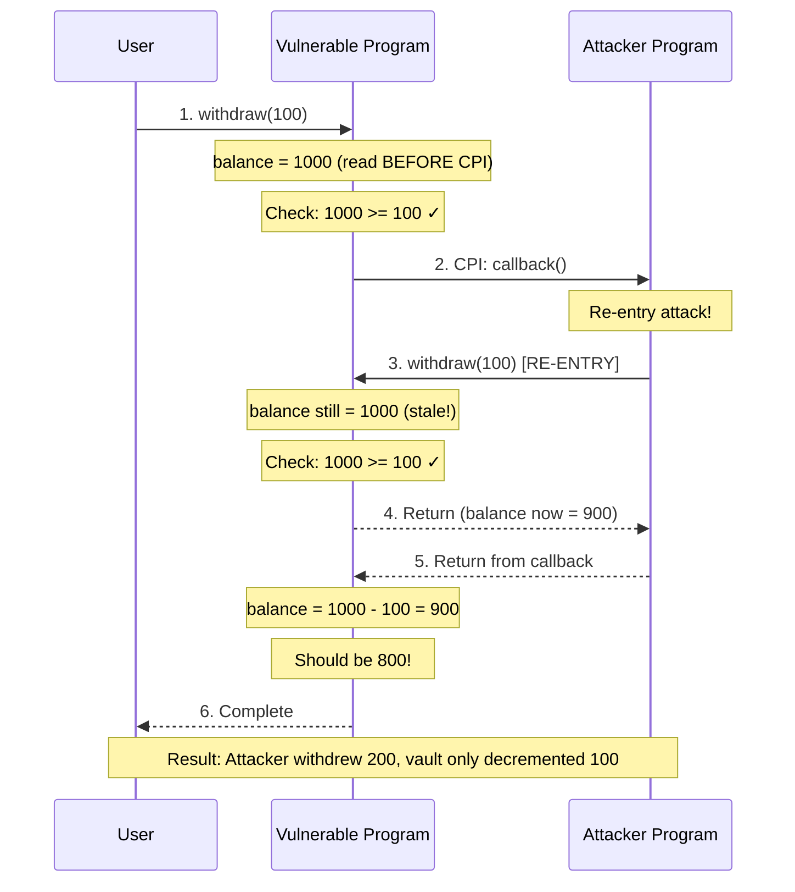

# Pattern 04: CPI Re-entrancy

> ## Common Misconception: "Solana Doesn't Have Re-entrancy"
>
> **Myth:** "Re-entrancy is an Ethereum problem. Solana's account model and single-threaded execution make it immune."
>
> **Reality:** While Solana's architecture differs from Ethereum, CPI (Cross-Program Invocation) creates re-entrancy attack vectors:
>
> | Aspect | Ethereum Re-entrancy | Solana CPI Re-entrancy |
> |--------|---------------------|------------------------|
> | Attack vector | External contract calls | CPI to malicious programs |
> | State scope | Contract storage | Account data |
> | Execution model | Call stack during external call | CPI depth up to 4 levels |
> | Classic example | DAO hack (withdraw → callback → re-withdraw) | Vault withdraw → callback → re-withdraw |
>
> **Why this matters for Solana:**
> - CPI allows programs to invoke other programs during execution
> - If your program makes a CPI **before** updating state, the invoked program can call back
> - The callback sees **stale state** (pre-update values) and can exploit this
> - Solana's CPI depth limit (4) only limits attack iterations, not the vulnerability itself
>
> **This pattern demonstrates:** How malicious callback programs exploit state-update-after-CPI vulnerabilities, and how to defend with checks-effects-interactions and re-entrancy guards.

## Vulnerability Description

CPI re-entrancy vulnerabilities occur when a Solana program makes a Cross-Program Invocation (CPI) to an external program **before** updating its internal state. The external program can then "re-enter" the original program through a callback, exploiting the fact that state still reflects pre-operation values.

**Key Insight:** The vulnerability exists in the **order of operations**:
1. Program reads state (e.g., balance = 1000)
2. Program validates (e.g., balance >= withdrawal)
3. Program makes CPI to external program ← **ATTACK WINDOW**
4. Program updates state (e.g., balance -= withdrawal) ← **TOO LATE**

During step 3, the external program can call back to step 1, which still sees the old balance.

## Attack Scenario

### CPI Re-entrancy Attack Flow



### Step-by-Step Attack Walkthrough

1. **Setup:** Attacker deposits 1000 tokens into vulnerable vault
2. **Initial Withdrawal:** Attacker calls `withdraw(100)` on vulnerable vault
3. **State Read:** Vulnerable program reads `balance = 1000` before CPI
4. **Validation:** Program checks `1000 >= 100` - passes
5. **CPI to Callback:** Vulnerable program invokes attacker's callback program
6. **Re-entry:** Attacker's callback immediately calls `withdraw(100)` again
7. **Stale State:** Vulnerable program reads same `balance = 1000` (not updated yet!)
8. **Second Validation:** `1000 >= 100` passes again
9. **Nested Return:** Inner withdrawal completes, sets `balance = 900`
10. **Outer Return:** Outer withdrawal completes, sets `balance = 1000 - 100 = 900`
11. **Result:** Two withdrawals of 100 each, but balance only decreased by 100

**Impact:** Attacker extracted 200 tokens but vault only recorded 100 withdrawn. This can be repeated (up to CPI depth limit) to drain the vault.

## Vulnerable Implementation

**File:** `programs/vulnerable/src/lib.rs`

```rust
/// VULNERABLE: Withdraw funds with callback to external program
pub fn withdraw(ctx: Context<Withdraw>, amount: u64) -> Result<()> {
    // VULNERABILITY: Read state BEFORE CPI
    // An attacker can exploit this because the balance check uses pre-CPI state
    let current_balance = ctx.accounts.vault.balance;
    let current_user_amount = ctx.accounts.user_deposit.amount;

    msg!("// VULNERABILITY: Reading balance BEFORE CPI: {}", current_balance);

    // VULNERABILITY: Check balance against pre-CPI state
    require!(current_balance >= amount, ErrorCode::InsufficientBalance);
    require!(current_user_amount >= amount, ErrorCode::InsufficientUserBalance);

    msg!("// VULNERABILITY: Balance check passed, making CPI to callback program");

    // VULNERABILITY: Make CPI BEFORE updating state
    // The external program can re-enter this function and withdraw again!
    let callback_ix = anchor_lang::solana_program::instruction::Instruction {
        program_id: ctx.accounts.callback_program.key(),
        accounts: vec![
            AccountMeta::new(ctx.accounts.vault.key(), false),
            AccountMeta::new(ctx.accounts.user_deposit.key(), false),
            AccountMeta::new_readonly(ctx.accounts.authority.key(), true),
            AccountMeta::new_readonly(ctx.accounts.vulnerable_program.key(), false),
            AccountMeta::new(ctx.accounts.attack_state.key(), false),
        ],
        data: build_callback_data(amount),
    };

    anchor_lang::solana_program::program::invoke(
        &callback_ix,
        &[
            ctx.accounts.vault.to_account_info(),
            ctx.accounts.user_deposit.to_account_info(),
            ctx.accounts.authority.to_account_info(),
            ctx.accounts.vulnerable_program.to_account_info(),
            ctx.accounts.attack_state.to_account_info(),
        ],
    )?;

    msg!("// VULNERABILITY: CPI returned, NOW updating state (too late!)");

    // VULNERABILITY: Update state AFTER CPI - attacker already re-entered!
    // At this point, if the attacker re-entered, they've already withdrawn
    // using the old balance value. This update is using stale data.
    ctx.accounts.vault.balance =
        current_balance.checked_sub(amount).ok_or(ErrorCode::InsufficientBalance)?;

    ctx.accounts.user_deposit.amount =
        current_user_amount.checked_sub(amount).ok_or(ErrorCode::InsufficientUserBalance)?;

    Ok(())
}
```

### Attacker Program (Callback Re-entry)

**File:** `programs/attacker/src/lib.rs`

```rust
/// ATTACK: Receive callback from vulnerable vault and re-enter
pub fn receive_callback(ctx: Context<ReceiveCallback>, amount: u64) -> Result<()> {
    msg!("// ATTACK: ====== CALLBACK RECEIVED ======");

    let attack_state = &mut ctx.accounts.attack_state;

    // ATTACK: Check if we've already re-entered (prevent infinite recursion)
    if attack_state.reentered {
        msg!("// ATTACK: Already re-entered once, stopping to demonstrate exploit");
        return Ok(());
    }

    // ATTACK: Mark that we're about to re-enter
    attack_state.reentered = true;

    msg!("// ATTACK: State still shows old balance - time to exploit!");

    // ATTACK: Build the withdraw instruction to re-enter vulnerable program
    let reentry_ix = Instruction {
        program_id: vulnerable_program_id,
        accounts: vec![/* ... vault, user_deposit, authority, etc. ... */],
        data: instruction_data, // withdraw discriminator + amount
    };

    msg!("// ATTACK: Executing re-entrancy CPI - DOUBLE WITHDRAWAL!");

    // ATTACK: Execute the re-entry CPI
    invoke(&reentry_ix, &[/* accounts */])?;

    msg!("// ATTACK: ====== RE-ENTRANCY SUCCESSFUL! ======");
    Ok(())
}
```

## Secure Implementation

**File:** `programs/secure/src/lib.rs`

```rust
/// SECURE: Withdraw funds with re-entrancy protection
pub fn withdraw(ctx: Context<Withdraw>, amount: u64) -> Result<()> {
    let vault = &mut ctx.accounts.vault;
    let user_deposit = &mut ctx.accounts.user_deposit;

    // SECURITY: Step 1 - Check re-entrancy guard FIRST
    // This blocks any attempt to re-enter while a withdrawal is in progress
    require!(!vault.reentrancy_guard, ErrorCode::ReentrancyDetected);

    msg!("// SECURITY: Re-entrancy guard check passed");

    // SECURITY: Step 2 - Set re-entrancy guard IMMEDIATELY
    vault.reentrancy_guard = true;

    msg!("// SECURITY: Re-entrancy guard SET - withdrawal in progress");

    // SECURITY: Step 3 - Perform balance checks
    require!(vault.balance >= amount, ErrorCode::InsufficientBalance);
    require!(user_deposit.amount >= amount, ErrorCode::InsufficientUserBalance);

    msg!("// SECURITY: Balance checks passed. Current balance: {}", vault.balance);

    // SECURITY: Step 4 - Update state BEFORE CPI (Effects before Interactions)
    // This is the KEY defense: even if an attacker re-enters, they'll see
    // the UPDATED balance, not the old one
    vault.balance = vault.balance.checked_sub(amount).ok_or(ErrorCode::InsufficientBalance)?;
    user_deposit.amount = user_deposit.amount.checked_sub(amount).ok_or(ErrorCode::InsufficientUserBalance)?;

    msg!("// SECURITY: State updated BEFORE CPI. New balance: {}", vault.balance);

    // SECURITY: Step 5 - Make CPI AFTER state is updated (Interactions)
    let callback_ix = anchor_lang::solana_program::instruction::Instruction {
        program_id: ctx.accounts.callback_program.key(),
        accounts: vec![/* ... */],
        data: build_callback_data(amount),
    };

    msg!("// SECURITY: Making CPI with state already updated");

    anchor_lang::solana_program::program::invoke(&callback_ix, &[/* accounts */])?;

    msg!("// SECURITY: CPI completed, clearing re-entrancy guard");

    // SECURITY: Step 6 - Clear re-entrancy guard after CPI completes
    let vault = &mut ctx.accounts.vault;
    vault.reentrancy_guard = false;

    msg!("// SECURITY: Re-entrancy guard CLEARED - withdrawal complete");
    Ok(())
}
```

### Secure Vault Account Structure

```rust
/// Vault account with re-entrancy protection
#[account]
pub struct Vault {
    /// Vault owner/authority (32 bytes)
    pub authority: Pubkey,
    /// Total vault balance (8 bytes)
    pub balance: u64,
    /// Tracks withdrawals in progress (8 bytes)
    pub withdrawals_pending: u64,
    /// SECURITY: Re-entrancy guard flag (1 byte)
    /// When true, blocks any new withdrawal attempts
    pub reentrancy_guard: bool,
    /// PDA bump seed (1 byte)
    pub bump: u8,
}
```

## Multiple Defense Patterns

### Pattern 1: Checks-Effects-Interactions (CEI)

The most fundamental defense - update all state **before** making any external calls.

```rust
pub fn withdraw_cei(ctx: Context<Withdraw>, amount: u64) -> Result<()> {
    let vault = &mut ctx.accounts.vault;

    // CHECKS: Validate all conditions first
    require!(vault.balance >= amount, ErrorCode::InsufficientBalance);

    // EFFECTS: Update state BEFORE external interaction
    vault.balance = vault.balance.checked_sub(amount)?;

    // INTERACTIONS: External calls LAST
    invoke(&callback_ix, &accounts)?;

    Ok(())
}
```

**When to use:** Always. This should be your default pattern for any function making CPIs.

### Pattern 2: Re-entrancy Guard (Mutex Lock)

A boolean flag that prevents recursive entry into critical sections.

```rust
#[account]
pub struct Vault {
    pub balance: u64,
    pub reentrancy_guard: bool,  // The mutex flag
}

pub fn withdraw_guarded(ctx: Context<Withdraw>, amount: u64) -> Result<()> {
    let vault = &mut ctx.accounts.vault;

    // CHECK: Reject if already in critical section
    require!(!vault.reentrancy_guard, ErrorCode::ReentrancyDetected);

    // LOCK: Set guard before any state changes
    vault.reentrancy_guard = true;

    // ... perform operations ...

    // UNLOCK: Clear guard after all operations complete
    vault.reentrancy_guard = false;

    Ok(())
}
```

**When to use:** When CEI alone is insufficient (complex multi-step operations) or as defense-in-depth.

### Pattern 3: Account Locking and Validation

Lock specific accounts during operations to prevent concurrent access.

```rust
#[account]
pub struct Vault {
    pub balance: u64,
    pub locked_until: i64,      // Unix timestamp
    pub lock_owner: Option<Pubkey>,
}

pub fn withdraw_with_lock(ctx: Context<Withdraw>, amount: u64) -> Result<()> {
    let vault = &mut ctx.accounts.vault;
    let clock = Clock::get()?;

    // CHECK: Account must not be locked by another user
    if let Some(owner) = vault.lock_owner {
        require!(
            owner == ctx.accounts.authority.key() || clock.unix_timestamp > vault.locked_until,
            ErrorCode::AccountLocked
        );
    }

    // LOCK: Claim exclusive access
    vault.lock_owner = Some(ctx.accounts.authority.key());
    vault.locked_until = clock.unix_timestamp + 60; // 60 second lock

    // ... perform operations ...

    // UNLOCK: Release
    vault.lock_owner = None;
    vault.locked_until = 0;

    Ok(())
}
```

**When to use:** Multi-step operations spanning multiple transactions, or time-sensitive operations.

### Pattern 4: CPI Privilege Restrictions

Restrict which programs can be invoked and validate caller identity.

```rust
// Allowlist of trusted callback programs
const TRUSTED_CALLBACKS: [&str; 2] = [
    "TrustedCallback1111111111111111111111111111",
    "TrustedCallback2222222222222222222222222222",
];

pub fn withdraw_restricted(ctx: Context<Withdraw>, amount: u64) -> Result<()> {
    // SECURITY: Only allow CPIs to trusted programs
    let callback_key = ctx.accounts.callback_program.key().to_string();
    require!(
        TRUSTED_CALLBACKS.contains(&callback_key.as_str()),
        ErrorCode::UntrustedCallback
    );

    // ... proceed with withdrawal ...

    Ok(())
}
```

**When to use:** When your program must interact with external programs but you can limit which ones.

### Defense Pattern Comparison

| Pattern | Protection Level | Complexity | Performance Impact | Best For |
|---------|-----------------|------------|-------------------|----------|
| CEI | High | Low | None | All CPI operations |
| Re-entrancy Guard | Very High | Low | Minimal (1 byte) | Critical sections |
| Account Locking | High | Medium | Moderate | Multi-tx operations |
| CPI Restrictions | Medium | Low | None | Known integrations |

**Recommended:** Combine **CEI + Re-entrancy Guard** for maximum protection with minimal overhead.

## Solana vs Ethereum Re-entrancy Comparison

| Aspect | Ethereum | Solana |
|--------|----------|--------|
| **Attack vector** | External contract calls via `call()` | CPI via `invoke()` / `invoke_signed()` |
| **State scope** | Contract storage (global to contract) | Account data (per-account) |
| **Call depth limit** | 1024 | 4 (CPI depth) |
| **Compute limits** | Gas limit | ~200k compute units (default) |
| **Classic defense** | ReentrancyGuard modifier | Re-entrancy guard flag in account |
| **Fundamental defense** | Checks-Effects-Interactions | Checks-Effects-Interactions |
| **Famous exploit** | The DAO ($60M, 2016) | No major public incidents (yet) |

### Why Ethereum Patterns Need Adaptation

**Ethereum ReentrancyGuard:**
```solidity
// Ethereum: OpenZeppelin ReentrancyGuard
modifier nonReentrant() {
    require(!_locked, "ReentrancyGuard: reentrant call");
    _locked = true;
    _;
    _locked = false;
}
```

**Solana Equivalent:**
```rust
// Solana: Must store guard in account data, not contract storage
#[account]
pub struct Vault {
    pub reentrancy_guard: bool,
}

pub fn guarded_operation(ctx: Context<Op>) -> Result<()> {
    require!(!ctx.accounts.vault.reentrancy_guard, ErrorCode::ReentrancyDetected);
    ctx.accounts.vault.reentrancy_guard = true;
    // ... operations ...
    ctx.accounts.vault.reentrancy_guard = false;
    Ok(())
}
```

**Key differences:**
- Ethereum's guard lives in contract storage (automatic persistence)
- Solana's guard must be explicitly stored in an account
- Solana's guard adds 1 byte to account size
- Both require manual clearing after operations

### Solana-Specific Considerations

1. **CPI Depth Limit (4 levels):** Provides some protection but not immunity. Attack flow:
   - User Tx → Vulnerable (1) → Attacker (2) → Vulnerable re-entry (3) → Attacker (4) [LIMIT]
   - Still allows 2 re-entries before hitting limit

2. **Compute Budget:** Default ~200k CU limits attack iterations, but:
   - Attackers can request higher budgets
   - Efficient exploits may complete in one iteration

3. **Account Model:** Each account can only be modified by its owner program, but:
   - Vulnerable programs can be tricked into modifying their own accounts incorrectly
   - The re-entrancy happens within the same program's execution context

## Running Tests

```bash
# Navigate to pattern directory
cd patterns/04-cpi-reentrancy

# Run all tests (vulnerable + secure + attacker comparison)
anchor test

# Run with verbose output to see attack flow
anchor test -- --nocapture

# Run specific test file
npx ts-mocha -p ./tsconfig.json -t 1000000 tests/exploit-demo.ts
```

### Expected Test Output

```
CPI RE-ENTRANCY PATTERN - EXPLOIT DEMO

VULNERABLE Vault Program
  ✓ allows normal single withdrawal (no attack)
  ✗ VULNERABLE: Demonstrates re-entrancy attack potential

SECURE Vault Program
  ✓ SECURE: Re-entrancy guard initialized to false
  ✓ SECURE: Checks-effects-interactions pattern prevents exploit
  ✓ SECURE: Normal withdrawal works correctly
  ✓ SECURE: Multiple sequential deposits work correctly

Side-by-Side Comparison
  ✓ compares vulnerable vs secure program behavior

7 passing
```

## CPI Security Checklist

Use this checklist when implementing any instruction that makes CPI calls:

### Pre-Implementation

- [ ] Identify all CPI calls in the instruction
- [ ] Determine if callback programs can be controlled by users
- [ ] Define error codes: `ReentrancyDetected`, `InvalidCallback`, `OperationInProgress`
- [ ] Decide which defense patterns to apply (CEI, guard, restrictions)
- [ ] Document the expected CPI flow and potential re-entry points

### Implementation

- [ ] Add `reentrancy_guard: bool` field to relevant account structures
- [ ] Check re-entrancy guard at instruction start: `require!(!account.reentrancy_guard, ...)`
- [ ] Set guard immediately after check: `account.reentrancy_guard = true`
- [ ] Perform all state reads and validation (CHECKS)
- [ ] Update all state before CPI (EFFECTS)
- [ ] Make CPI calls last (INTERACTIONS)
- [ ] Clear guard after CPI completes: `account.reentrancy_guard = false`
- [ ] Add `// SECURITY:` comments explaining each protection
- [ ] Add `// VULNERABILITY:` comments in educational code showing the risk

### Post-Implementation Review

- [ ] Verify no state is read into local variables before CPI and used after
- [ ] Verify all balance/state updates happen before any CPI
- [ ] Verify re-entrancy guard is checked before any state reads
- [ ] Test with malicious callback program attempting re-entry
- [ ] Test that guard doesn't break sequential legitimate operations
- [ ] Test CPI depth limit behavior (should fail gracefully)
- [ ] Review: "What would an attacker see if they called back from the CPI?"
- [ ] Verify error messages are clear for re-entrancy detection

### Defense Verification

- [ ] CEI pattern: State updates confirmed before all CPIs
- [ ] Re-entrancy guard: Added for user-controlled callback targets
- [ ] Account locking: Added if multi-transaction operations exist
- [ ] CPI restrictions: Added if callback targets can be allowlisted

## Key Takeaways

1. **Always use Checks-Effects-Interactions (CEI)** - Update all state before making any CPI calls. This is the fundamental defense against re-entrancy.

2. **Add re-entrancy guards for critical operations** - A simple boolean flag provides defense-in-depth. The 1-byte overhead is negligible for the protection gained.

3. **CPI depth limit is not sufficient protection** - Solana's 4-level CPI limit reduces but doesn't eliminate the attack surface. One re-entry is enough to exploit most vulnerabilities.

4. **Validate callback program addresses** - When possible, restrict CPIs to known, trusted programs rather than accepting arbitrary callback addresses.

5. **Think like an attacker** - For any instruction that makes a CPI, ask: "What if the invoked program immediately calls back into my program? What state will it see?"

6. **Test with malicious callbacks** - Write tests that simulate attacker programs attempting re-entry to verify your defenses work.

## Anchor vs Pinocchio Comparison

This pattern includes implementations in both **Anchor** and **Pinocchio** frameworks to demonstrate how CPI re-entrancy vulnerabilities and defenses translate across frameworks.

### Framework Comparison Table

| Aspect | Anchor | Pinocchio |
|--------|--------|-----------|
| **CPI Invocation** | `CpiContext::new()` + typed calls | Manual `Instruction` + `invoke()` |
| **Account Validation** | Declarative macros (`#[account]`) | Manual `owned_by()`, `is_signer()` |
| **Error Handling** | `#[error_code]` + `require!()` | Manual enum + if-checks |
| **Discriminators** | Auto-generated (8-byte hash) | Manual u8 discriminators |
| **Re-entrancy Guard** | Same pattern, concise syntax | Same pattern, explicit implementation |
| **Lines of Code** | ~150 per program | ~300 per program |
| **Compiled Size** | Larger (Anchor overhead) | Smaller (minimal dependencies) |

### CPI Invocation: Side-by-Side

**Anchor CPI:**
```rust
// Anchor: Type-safe CPI with CpiContext
let cpi_ctx = CpiContext::new(
    ctx.accounts.callback_program.to_account_info(),
    ReceiveCallback {
        vault: ctx.accounts.vault.to_account_info(),
        authority: ctx.accounts.authority.to_account_info(),
        // ...
    }
);
attacker::cpi::receive_callback(cpi_ctx, amount)?;
```

**Pinocchio CPI:**
```rust
// Pinocchio: Manual instruction construction
let callback_ix = Instruction {
    program_id: callback_program.address(),
    accounts: vec![
        AccountMeta::writable(*vault.address(), false),
        AccountMeta::readonly(*authority.address(), true),
        // ...
    ],
    data: callback_data, // Manual serialization: [discriminator, amount_bytes...]
};

invoke(&callback_ix, &[vault, authority, ...])?;
```

### Account Structure: Side-by-Side

**Anchor Vault (58 bytes):**
```rust
#[account]
pub struct Vault {
    pub authority: Pubkey,        // 32 bytes
    pub balance: u64,             // 8 bytes
    pub withdrawals_pending: u64, // 8 bytes
    pub reentrancy_guard: bool,   // 1 byte
    pub bump: u8,                 // 1 byte
}
// + 8 bytes Anchor discriminator = 58 bytes total
```

**Pinocchio Vault (50 bytes):**
```rust
pub struct Vault {
    pub authority: Address,       // 32 bytes
    pub balance: u64,             // 8 bytes
    pub withdrawals_pending: u64, // 8 bytes
    pub reentrancy_guard: bool,   // 1 byte
    pub bump: u8,                 // 1 byte
}
// No discriminator overhead = 50 bytes total
// Savings: 8 bytes (13.8% smaller)
```

### Error Handling: Side-by-Side

**Anchor Errors:**
```rust
#[error_code]
pub enum ErrorCode {
    #[msg("Re-entrancy detected: Operation already in progress")]
    ReentrancyDetected = 6005,

    #[msg("Insufficient balance for withdrawal")]
    InsufficientBalance = 6002,
}

// Usage:
require!(!vault.reentrancy_guard, ErrorCode::ReentrancyDetected);
```

**Pinocchio Errors:**
```rust
#[derive(Debug, Clone, Copy)]
#[repr(u32)]
pub enum SecureError {
    ReentrancyDetected = 6005,
    InsufficientBalance = 6002,
}

impl From<SecureError> for ProgramError {
    fn from(e: SecureError) -> Self {
        ProgramError::Custom(e as u32)
    }
}

// Usage:
if vault.reentrancy_guard {
    return Err(SecureError::ReentrancyDetected.into());
}
```

### Re-entrancy Guard Implementation

Both frameworks implement the same defensive pattern:

1. **Check guard first** - Reject if already set
2. **Set guard immediately** - Before any state changes
3. **Update state before CPI** - Effects before Interactions
4. **Make CPI** - Safe because state is already updated
5. **Clear guard** - After CPI completes

The only difference is **syntax verbosity** - Pinocchio requires more explicit code, but the security logic is identical.

### Trade-offs Summary

| Choose Anchor When | Choose Pinocchio When |
|-------------------|----------------------|
| Rapid development needed | Compute budget is critical |
| Type safety is priority | Minimal program size needed |
| Large team collaboration | Maximum control over bytes |
| Need Anchor ecosystem tools | Custom serialization required |

### Security Implication

**Key Insight:** Re-entrancy protection is **framework-agnostic**. Both Anchor and Pinocchio require the same defensive patterns:
- Checks-Effects-Interactions (CEI)
- Re-entrancy guards
- Careful CPI ordering

Pinocchio makes the implementation more explicit but provides no additional security. Developers must implement guards manually in either case.

## File Structure

```
patterns/04-cpi-reentrancy/
├── programs/
│   ├── vulnerable/              # Anchor vulnerable vault (state update AFTER CPI)
│   │   ├── Cargo.toml
│   │   └── src/lib.rs
│   ├── secure/                  # Anchor secure vault (CEI + re-entrancy guard)
│   │   ├── Cargo.toml
│   │   └── src/lib.rs
│   └── attacker/                # Anchor malicious callback demonstrating exploit
│       ├── Cargo.toml
│       └── src/lib.rs
├── pinocchio-programs/
│   ├── pinocchio-vulnerable/    # Pinocchio vulnerable vault
│   │   ├── Cargo.toml
│   │   └── src/lib.rs
│   ├── pinocchio-secure/        # Pinocchio secure vault
│   │   ├── Cargo.toml
│   │   └── src/lib.rs
│   └── pinocchio-attacker/      # Pinocchio attacker program
│       ├── Cargo.toml
│       └── src/lib.rs
├── tests/
│   ├── exploit-demo.ts          # Anchor test suite
│   └── pinocchio-exploit-demo.ts # Pinocchio test suite
├── Anchor.toml
└── README.md

docs/deep-dive/
└── cpi-reentrancy.md            # Comprehensive educational deep-dive
```

## Deep Dive

For comprehensive educational content on CPI re-entrancy vulnerabilities, including:
- Solana's program execution model explanation
- CPI mechanics deep-dive (invoke, invoke_signed, CPI context)
- Re-entrancy vulnerability anatomy with detailed code analysis
- Real-world case studies and incident references
- Common vulnerable patterns in DeFi applications
- Decision guide for defense pattern selection

**See: [Deep Dive: CPI Re-entrancy](/docs/deep-dive/cpi-reentrancy.md)**

## Related Patterns

- [Pattern 01: Missing Validation](../01-missing-validation/) - Input validation fundamentals
- [Pattern 02: Authority Checks](../02-authority-checks/) - Access control patterns
- [Pattern 03: Unsafe Arithmetic](../03-unsafe-arithmetic/) - Arithmetic safety (checked operations used in secure vault)

## References

- [Solana CPI Documentation](https://solana.com/docs/core/cpi)
- [Anchor CPI Guide](https://www.anchor-lang.com/docs/cross-program-invocations)
- [Sealevel Attacks - Re-entrancy](https://github.com/coral-xyz/sealevel-attacks)
- [OpenZeppelin ReentrancyGuard (Ethereum comparison)](https://docs.openzeppelin.com/contracts/4.x/api/security#ReentrancyGuard)
- [The DAO Hack Analysis (Ethereum historical context)](https://blog.ethereum.org/2016/06/17/critical-update-re-dao-vulnerability)
- [Solidity by Example - Re-entrancy](https://solidity-by-example.org/hacks/re-entrancy/)
