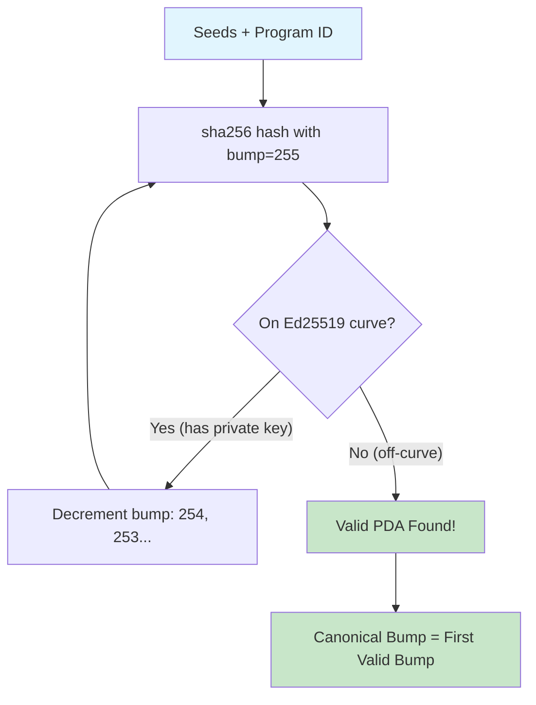
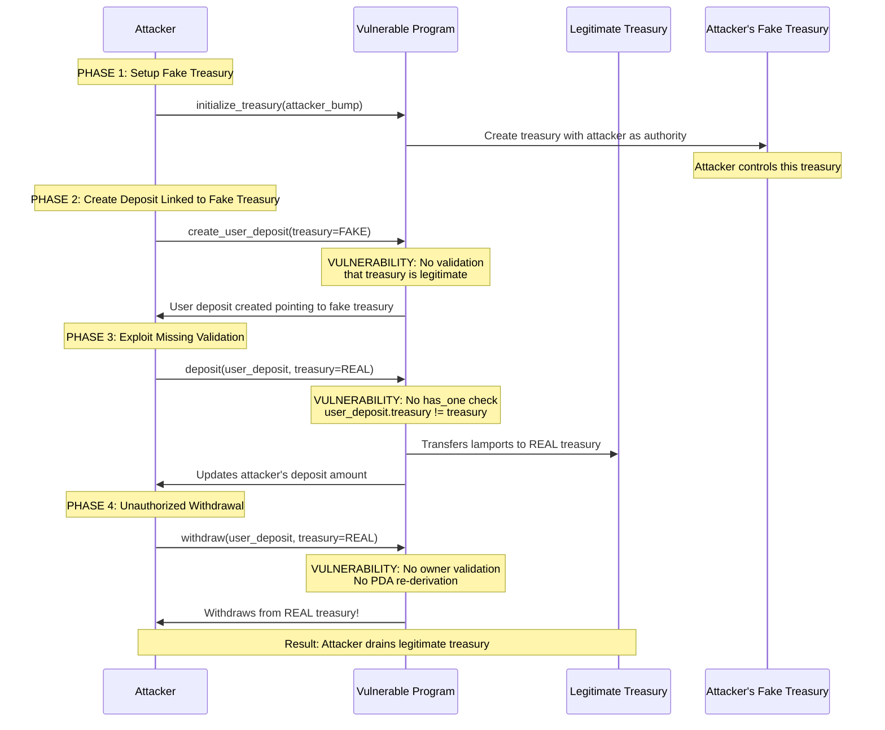

# Pattern 05: PDA Derivation & Validation

> ## Common Misconception: "PDAs Are Just Addresses"
>
> **Myth:** "PDAs are just deterministic addresses. If I derive the same address, my program is secure."
>
> **Reality:** PDA security requires more than correct derivation:
>
> | What Developers Think | What Actually Matters |
> |----------------------|----------------------|
> | "I derived the PDA correctly" | Is the PDA **re-validated** on every access? |
> | "I stored the bump seed" | Is it the **canonical** (highest valid) bump? |
> | "Seeds match my expected pattern" | Are **all seed components** validated? |
> | "Account exists at the address" | Does the account **belong** to the expected program? |
>
> **Why this matters:**
> - Attackers can create accounts at non-canonical bump addresses
> - User-provided PDAs can be substituted with malicious accounts
> - Missing seed validation allows relationship bypasses
> - Stored bumps without validation enable PDA grinding attacks
>
> **This pattern demonstrates:** How attackers exploit PDA validation gaps, and how to defend with proper seed constraints, canonical bump enforcement, and relationship validation.

## Table of Contents

- [Overview](#overview)
- [Solana PDA Model](#solana-pda-model)
  - [What is a PDA?](#what-is-a-pda)
  - [PDA Derivation Process](#pda-derivation-process)
  - [Bump Seeds and Canonical Bumps](#bump-seeds-and-canonical-bumps)
  - [Why Off-Curve Matters](#why-off-curve-matters)
- [Common PDA Vulnerabilities](#common-pda-vulnerabilities)
  - [Missing PDA Validation](#1-missing-pda-validation)
  - [User-Controlled Seeds](#2-user-controlled-seeds)
  - [Non-Canonical Bump Seeds](#3-non-canonical-bump-seeds)
  - [PDA Substitution Attacks](#4-pda-substitution-attacks)
  - [Vulnerability Comparison Table](#vulnerability-comparison-table)
- [Attack Scenario Walkthrough](#attack-scenario-walkthrough)
  - [PDA Substitution Attack Flow](#pda-substitution-attack-flow)
  - [Step-by-Step Attack Narrative](#step-by-step-attack-narrative)
  - [How Secure Implementation Blocks the Attack](#how-secure-implementation-blocks-the-attack)
- [Vulnerable Implementation](#vulnerable-implementation)
- [Secure Implementation](#secure-implementation)
- [Multiple PDA Patterns](#multiple-pda-patterns)
  - [Pattern 1: Global/Config PDA](#pattern-1-globalconfig-pda)
  - [Pattern 2: User-Specific PDA](#pattern-2-user-specific-pda)
  - [Pattern 3: Hierarchical PDAs](#pattern-3-hierarchical-pdas)
  - [Pattern 4: Multi-Seed PDAs](#pattern-4-multi-seed-pdas)
- [Anchor PDA Constraints Reference](#anchor-pda-constraints-reference)
  - [Seeds Constraint](#seeds-constraint)
  - [Bump Constraint](#bump-constraint)
  - [Has One Constraint](#has_one-constraint)
  - [Anchor vs Manual Validation](#anchor-vs-manual-validation)
  - [Decision Guide](#decision-guide-when-to-use-each-approach)
- [Pinocchio Framework Comparison](#pinocchio-framework-comparison)
  - [Pinocchio PDA Derivation](#pinocchio-pda-derivation)
  - [Anchor vs Pinocchio Constraint Mapping](#anchor-vs-pinocchio-constraint-mapping)
  - [Security Validation Comparison](#security-validation-comparison)
  - [Trade-offs Analysis](#trade-offs-analysis)
- [Running the Demo](#running-the-demo)
- [Key Takeaways](#key-takeaways)
- [Related Patterns](#related-patterns)
- [References](#references)

---

## Overview

Program Derived Addresses (PDAs) are a fundamental building block of Solana programs. They enable programs to "own" accounts and sign transactions programmatically. However, improper PDA validation is one of the most common vulnerability classes in Solana development.

This pattern demonstrates:

1. **The Vulnerability**: Programs that accept PDAs without proper validation
2. **The Exploit**: How attackers substitute fake PDAs or manipulate bumps
3. **The Fix**: Proper Anchor constraints that ensure PDA authenticity

**Learning Objectives:**

After studying this pattern, you will understand:

- How PDAs are derived and why the canonical bump matters
- Why PDAs must be off-curve (no private key) for security
- Common PDA vulnerability patterns and how to identify them
- How to use Anchor's `seeds`, `bump`, and `has_one` constraints effectively
- Best practices for hierarchical PDA design

---

## Solana PDA Model

### What is a PDA?

A Program Derived Address (PDA) is a special type of Solana address that:

1. **Is derived deterministically** from a set of seeds and a program ID
2. **Has no private key** - only the program can "sign" for it
3. **Can store data** - programs use PDAs as data accounts
4. **Enables program authority** - programs can transfer lamports from PDAs

| Property | Regular Keypair | PDA |
|----------|----------------|-----|
| Has private key | Yes | No |
| Can sign transactions | User signs | Program signs via `invoke_signed` |
| Address derivation | Random (Ed25519) | Deterministic (seeds + program ID) |
| Controlled by | Private key holder | Owning program only |

### PDA Derivation Process

PDAs are derived using a specific algorithm that ensures the resulting address is **off the Ed25519 curve**:



**Diagram Explanation:** The PDA derivation algorithm starts with bump=255 and computes `sha256(seeds || [bump] || program_id || "ProgramDerivedAddress")`. If the result is on the Ed25519 curve (meaning a private key could exist), it decrements the bump and tries again. The first off-curve result is the PDA with its **canonical bump** (the highest valid bump value).

**Code Example - Manual Derivation:**

```rust
// Manual PDA derivation using Pubkey::find_program_address
let (pda, canonical_bump) = Pubkey::find_program_address(
    &[
        b"treasury",
        authority.key().as_ref(),
    ],
    program_id
);
// canonical_bump is guaranteed to be the highest valid bump (e.g., 254)
```

**Code Example - Anchor Derivation:**

```rust
// Anchor handles derivation automatically with seeds constraint
#[account(
    seeds = [b"treasury", authority.key().as_ref()],
    bump  // Anchor finds canonical bump
)]
pub treasury: Account<'info, Treasury>,
```

### Bump Seeds and Canonical Bumps

The **bump seed** is a single byte (0-255) appended to the seeds during derivation. The **canonical bump** is the highest valid bump that produces an off-curve address.

**Why Canonical Bump Matters:**

```
Seeds: ["treasury", authority_pubkey]
Program ID: 4bEDU5VynGAFuZ1MXF1HU4oNLDv5XaDyBZwDARYszCwm

Bump 255: On-curve (INVALID - has private key!)
Bump 254: Off-curve (VALID - canonical bump!)
Bump 253: Off-curve (VALID - but NOT canonical)
Bump 252: On-curve (INVALID)
Bump 251: Off-curve (VALID - but NOT canonical)
...
```

**Security Implication:** If a program accepts non-canonical bumps, multiple "valid" PDAs could exist for the same seeds. An attacker might:

1. Find a non-canonical bump that produces a different address
2. Create an account at that address with malicious data
3. Pass it to your program as "valid" because the bump is technically valid

**The Fix:** Always use `bump = account.bump` with stored canonical bump, or let Anchor find it automatically.

### Why Off-Curve Matters

Ed25519 is the elliptic curve used for Solana keypairs. Points **on the curve** have corresponding private keys; points **off the curve** do not.

```
Ed25519 Curve:
                    ╭─────────────────╮
                   ╱                   ╲
                  │   On-Curve Points   │  ← Have private keys
                  │   (Regular keypairs)│  ← Anyone who knows the key can sign
                   ╲                   ╱
                    ╰─────────────────╯

    Off-Curve Points (PDAs):
    • Cannot be signed by any private key
    • Only the program can "sign" via invoke_signed
    • Secure for program-controlled accounts
```

**Security Implications:**

| Point Type | Private Key Exists | Who Can Sign | Security Risk |
|------------|-------------------|--------------|---------------|
| On-curve | Yes | Anyone with key | Attacker could sign |
| Off-curve (PDA) | No | Program only | Secure - no external signing |

If your program accidentally accepts an on-curve address as a PDA, an attacker who knows the private key could:
1. Sign transactions as if they were the "PDA"
2. Drain funds or modify state
3. Bypass all program authority checks

---

## Common PDA Vulnerabilities

### 1. Missing PDA Validation

**The Problem:** Program accepts any account without verifying it matches expected PDA derivation.

**Vulnerable Code** (from [`programs/vulnerable/src/lib.rs:242-258`](programs/vulnerable/src/lib.rs)):

```rust
// VULNERABILITY: No seeds constraint to re-derive and validate PDA
// VULNERABILITY: No has_one constraint to verify owner
#[derive(Accounts)]
pub struct Withdraw<'info> {
    #[account(mut)]
    pub user_deposit: Account<'info, UserDeposit>,  // Any account accepted!

    #[account(mut)]
    pub treasury: Account<'info, Treasury>,  // No validation!

    #[account(mut)]
    pub withdrawer: Signer<'info>,

    pub system_program: Program<'info, System>,
}
```

**Attack Vector:** Attacker passes a fake `user_deposit` account they created with inflated balance.

**Secure Code** (from [`programs/secure/src/lib.rs:308-343`](programs/secure/src/lib.rs)):

```rust
// SECURITY: Full PDA re-derivation and relationship validation
#[derive(Accounts)]
pub struct Withdraw<'info> {
    #[account(
        mut,
        // SECURITY: Re-derive PDA to verify authenticity
        seeds = [USER_DEPOSIT_SEED, treasury.key().as_ref(), withdrawer.key().as_ref()],
        // SECURITY: Enforce canonical bump
        bump = user_deposit.bump,
        // SECURITY: Validate relationships
        has_one = treasury,
        has_one = owner @ PdaError::UnauthorizedAccess
    )]
    pub user_deposit: Account<'info, UserDeposit>,
    // ... treasury with seeds constraint ...
}
```

### 2. User-Controlled Seeds

**The Problem:** Program uses user-provided data as seeds without validation, allowing attackers to derive PDAs they control.

**Vulnerable Pattern:**

```rust
// VULNERABILITY: User can control seed_value to derive any PDA they want
pub fn initialize(ctx: Context<Initialize>, seed_value: String) -> Result<()> {
    // Attacker passes seed_value that derives to an existing account
    // or a predictable address they've pre-seeded
}

#[derive(Accounts)]
pub struct Initialize<'info> {
    #[account(
        init,
        seeds = [seed_value.as_bytes()],  // User-controlled!
        bump
    )]
    pub data_account: Account<'info, DataAccount>,
}
```

**Secure Pattern:**

```rust
// SECURITY: Use program-controlled seeds with verified components
#[derive(Accounts)]
pub struct Initialize<'info> {
    #[account(
        init,
        // User pubkey is verified via Signer<'info>
        seeds = [b"config", authority.key().as_ref()],
        bump
    )]
    pub config: Account<'info, Config>,

    pub authority: Signer<'info>,  // Verified signer
}
```

### 3. Non-Canonical Bump Seeds

**The Problem:** Program accepts user-provided bumps without verifying they match the canonical bump.

**Vulnerable Code** (from [`programs/vulnerable/src/lib.rs:70-77`](programs/vulnerable/src/lib.rs)):

```rust
pub fn initialize_treasury(ctx: Context<InitializeTreasury>, bump: u8) -> Result<()> {
    let treasury = &mut ctx.accounts.treasury;

    treasury.authority = ctx.accounts.authority.key();
    treasury.balance = 0;
    // VULNERABILITY: Storing user-provided bump without validation
    // In a secure version, we would use the bump from Anchor's derivation
    treasury.bump = bump;

    Ok(())
}
```

**Secure Code** (from [`programs/secure/src/lib.rs:86-102`](programs/secure/src/lib.rs)):

```rust
pub fn initialize_treasury(ctx: Context<InitializeTreasury>) -> Result<()> {
    let treasury = &mut ctx.accounts.treasury;

    treasury.authority = ctx.accounts.authority.key();
    treasury.balance = 0;
    // SECURITY: Store the canonical bump from Anchor's derivation
    // This bump is guaranteed to be the highest valid bump (canonical)
    treasury.bump = ctx.bumps.treasury;

    Ok(())
}
```

### 4. PDA Substitution Attacks

**The Problem:** Program doesn't verify that related accounts (e.g., user_deposit → treasury) match expected derivations.

**Vulnerable Code** (from [`programs/vulnerable/src/lib.rs:215-218`](programs/vulnerable/src/lib.rs)):

```rust
#[derive(Accounts)]
pub struct CreateUserDeposit<'info> {
    // ...
    /// VULNERABILITY: Treasury is accepted as AccountInfo, no type checking
    /// An attacker could pass any account here
    /// CHECK: Intentionally vulnerable - no validation performed
    pub treasury: AccountInfo<'info>,  // Any account accepted!
    // ...
}
```

**Attack Scenario:**
1. Attacker creates their own treasury with themselves as authority
2. Attacker creates user_deposit linked to their fake treasury
3. Attacker deposits to legitimate treasury but manipulates their deposit record
4. Attacker withdraws more than they deposited

**Secure Code** (from [`programs/secure/src/lib.rs:246-265`](programs/secure/src/lib.rs)):

```rust
#[derive(Accounts)]
pub struct CreateUserDeposit<'info> {
    #[account(
        init,
        seeds = [USER_DEPOSIT_SEED, treasury.key().as_ref(), owner.key().as_ref()],
        bump
    )]
    pub user_deposit: Account<'info, UserDeposit>,

    /// SECURITY: Type-checked as Account<Treasury>, ensuring valid treasury
    pub treasury: Account<'info, Treasury>,  // Type-safe!
    // ...
}
```

### Vulnerability Comparison Table

| Vulnerability | Vulnerable Pattern | Secure Pattern | Impact |
|--------------|-------------------|----------------|--------|
| Missing PDA validation | `#[account(mut)]` only | `seeds = [...], bump = account.bump` | Account substitution |
| User-controlled seeds | `seeds = [user_input.as_bytes()]` | `seeds = [b"prefix", signer.key().as_ref()]` | PDA forgery |
| Non-canonical bump | `treasury.bump = user_bump` | `treasury.bump = ctx.bumps.treasury` | Multiple valid PDAs |
| Missing relationship | `pub treasury: AccountInfo<'info>` | `pub treasury: Account<'info, Treasury>` + `has_one` | Wrong account linkage |
| Missing authorization | No `has_one = owner` | `has_one = owner @ Error` | Unauthorized access |

---

## Attack Scenario Walkthrough

### PDA Substitution Attack Flow



**Diagram Explanation:** This sequence diagram shows a four-phase PDA substitution attack. The attacker first creates their own fake treasury, then creates a user deposit pointing to it. Due to missing `has_one` validation, the attacker can deposit to the real treasury while their deposit record updates. Finally, they withdraw from the real treasury because the program doesn't validate PDA derivation or ownership.

### Step-by-Step Attack Narrative

**Step 1: Reconnaissance**

The attacker identifies the vulnerable program and analyzes its validation gaps:

```typescript
// Attacker examines program accounts
const vulnerableTreasury = await vulnerableProgram.account.treasury.fetch(
  victimTreasuryPda
);
console.log("Target treasury balance:", vulnerableTreasury.balance.toString());
// All on-chain data is public - attacker knows the target
```

**Step 2: Create Fake Treasury**

```typescript
// Attacker creates their own treasury
await vulnerableProgram.methods
  .initializeTreasury(attackerTreasuryBump)
  .accounts({
    treasury: attackerTreasuryPda,
    authority: attacker.publicKey,  // Attacker is authority
    systemProgram: SystemProgram.programId,
  })
  .signers([attacker])
  .rpc();
```

**Step 3: Create User Deposit with Wrong Treasury**

```typescript
// VULNERABILITY: Program accepts any treasury without validation
await vulnerableProgram.methods
  .createUserDeposit(attackerDepositBump)
  .accounts({
    userDeposit: attackerDepositPda,
    treasury: attackerTreasuryPda,  // Points to attacker's treasury!
    owner: attacker.publicKey,
    systemProgram: SystemProgram.programId,
  })
  .signers([attacker])
  .rpc();
```

**Step 4: Exploit Missing Relationship Validation**

```typescript
// VULNERABILITY: No has_one constraint validates relationship
// Attacker can pass mismatched treasury
await vulnerableProgram.methods
  .deposit(depositAmount)
  .accounts({
    userDeposit: attackerDepositPda,  // Points to attacker's treasury
    treasury: legitTreasuryPda,        // But depositing to REAL treasury!
    depositor: attacker.publicKey,
    systemProgram: SystemProgram.programId,
  })
  .signers([attacker])
  .rpc();
```

### How Secure Implementation Blocks the Attack

**Defense 1: Seeds Constraint Re-derives PDA**

```rust
#[account(
    mut,
    seeds = [USER_DEPOSIT_SEED, treasury.key().as_ref(), withdrawer.key().as_ref()],
    bump = user_deposit.bump,
)]
pub user_deposit: Account<'info, UserDeposit>,
```

The `seeds` constraint computes the expected PDA from the provided accounts. If the attacker passes a different treasury, the derived PDA won't match `user_deposit.key()`.

**Defense 2: Has One Validates Relationships**

```rust
#[account(
    has_one = treasury,
    has_one = owner @ PdaError::UnauthorizedAccess
)]
pub user_deposit: Account<'info, UserDeposit>,
```

This checks that `user_deposit.treasury == treasury.key()`, blocking the mismatched treasury attack.

**Defense 3: Type Safety with Account<T>**

```rust
// Secure: Type-checked, ensures account is valid Treasury
pub treasury: Account<'info, Treasury>,

// Vulnerable: No type checking, any account accepted
pub treasury: AccountInfo<'info>,
```

**Test Output Reference** (from [`tests/exploit-demo.ts`](tests/exploit-demo.ts)):

```
VULNERABLE Treasury Program
  ✓ initializes treasury with canonical bump
  ✗ VULNERABLE: Accepts different treasury without validation
  ✗ VULNERABLE: Missing relationship validation on deposit
  ✗ VULNERABLE: Withdraw without proper authorization

SECURE Treasury Program
  ✓ SECURE: Treasury PDA properly derived and validated
  ✓ SECURE: Rejects wrong treasury in user deposit operations
  ✓ SECURE: Rejects unauthorized withdrawal attempts
  ✓ SECURE: Valid deposit and withdraw work correctly
  ✓ SECURE: Hierarchical PDA ensures unique deposits per treasury+user
```

---

## Vulnerable Implementation

**File:** [`programs/vulnerable/src/lib.rs`](programs/vulnerable/src/lib.rs)

The vulnerable implementation demonstrates several PDA-related security issues:

```rust
// VULNERABILITY 1: User-provided bump stored without validation (line 70-77)
pub fn initialize_treasury(ctx: Context<InitializeTreasury>, bump: u8) -> Result<()> {
    let treasury = &mut ctx.accounts.treasury;
    treasury.bump = bump;  // User controls bump!
    Ok(())
}

// VULNERABILITY 2: Treasury accepted as AccountInfo (line 215-218)
#[derive(Accounts)]
pub struct CreateUserDeposit<'info> {
    /// CHECK: Intentionally vulnerable - no validation
    pub treasury: AccountInfo<'info>,  // No type safety!
}

// VULNERABILITY 3: No seeds/has_one constraints (line 242-258)
#[derive(Accounts)]
pub struct Withdraw<'info> {
    #[account(mut)]
    pub user_deposit: Account<'info, UserDeposit>,  // No seeds validation!

    #[account(mut)]
    pub treasury: Account<'info, Treasury>,  // No relationship check!
}
```

**Key Vulnerable Lines:**
- Lines 70-77: Accepts user-provided bump
- Lines 215-218: Treasury as `AccountInfo` instead of `Account<Treasury>`
- Lines 242-258: Missing `has_one` and `seeds` constraints on withdraw

---

## Secure Implementation

**File:** [`programs/secure/src/lib.rs`](programs/secure/src/lib.rs)

The secure implementation demonstrates proper PDA validation:

```rust
// SECURITY 1: Canonical bump from Anchor (line 86-102)
pub fn initialize_treasury(ctx: Context<InitializeTreasury>) -> Result<()> {
    let treasury = &mut ctx.accounts.treasury;
    // SECURITY: Store canonical bump from Anchor's derivation
    treasury.bump = ctx.bumps.treasury;  // Guaranteed canonical!
    Ok(())
}

// SECURITY 2: Type-safe treasury (line 246-265)
#[derive(Accounts)]
pub struct CreateUserDeposit<'info> {
    /// SECURITY: Type-checked as Account<Treasury>
    pub treasury: Account<'info, Treasury>,  // Type safe!
}

// SECURITY 3: Full validation chain (line 308-343)
#[derive(Accounts)]
pub struct Withdraw<'info> {
    #[account(
        mut,
        // SECURITY: Re-derive PDA
        seeds = [USER_DEPOSIT_SEED, treasury.key().as_ref(), withdrawer.key().as_ref()],
        // SECURITY: Canonical bump
        bump = user_deposit.bump,
        // SECURITY: Relationship validation
        has_one = treasury,
        has_one = owner @ PdaError::UnauthorizedAccess
    )]
    pub user_deposit: Account<'info, UserDeposit>,

    #[account(
        mut,
        seeds = [TREASURY_SEED, treasury.authority.as_ref()],
        bump = treasury.bump
    )]
    pub treasury: Account<'info, Treasury>,
}
```

**Key Secure Lines:**
- Lines 86-102: Uses `ctx.bumps.treasury` for canonical bump
- Lines 246-265: Type-safe `Account<Treasury>` with hierarchical seeds
- Lines 308-343: Full constraint chain with seeds, bump, and has_one

---

## Multiple PDA Patterns

### Pattern 1: Global/Config PDA

A single PDA per program for global configuration.

**Seeds:** `["config"]` or `["program_config", program_id]`

```rust
// Global config - one per program
#[account(
    init,
    payer = admin,
    space = 8 + Config::INIT_SPACE,
    seeds = [b"config"],
    bump
)]
pub config: Account<'info, Config>,
```

**Use Cases:**
- Program-wide settings (fees, paused state)
- Admin/upgrade authority storage
- Global counters or statistics

**Secure Seed Design:**
- Use static seeds for truly global accounts
- Include program ID if config spans multiple programs
- Store the canonical bump for efficient re-derivation

### Pattern 2: User-Specific PDA

One PDA per user, using their pubkey as a seed.

**Seeds:** `["user_account", user_pubkey]`

```rust
// User-specific account
#[account(
    init,
    payer = user,
    space = 8 + UserAccount::INIT_SPACE,
    seeds = [b"user_account", user.key().as_ref()],
    bump
)]
pub user_account: Account<'info, UserAccount>,

pub user: Signer<'info>,  // User must sign - key is validated!
```

**Use Cases:**
- User profiles or settings
- Token accounts (non-ATA pattern)
- User-specific state (balances, scores)

**Secure Seed Design:**
- Always derive from `Signer<'info>` to validate key ownership
- Use meaningful prefixes to avoid collisions
- Store user pubkey in account for relationship validation

### Pattern 3: Hierarchical PDAs

PDAs that reference other PDAs in their derivation.

**Seeds:** `["user_deposit", treasury_pda, user_pubkey]`

```rust
// Treasury PDA (parent)
#[account(
    seeds = [b"treasury", authority.key().as_ref()],
    bump = treasury.bump
)]
pub treasury: Account<'info, Treasury>,

// User deposit PDA (child) - includes treasury in seeds
#[account(
    init,
    payer = user,
    seeds = [b"user_deposit", treasury.key().as_ref(), user.key().as_ref()],
    bump
)]
pub user_deposit: Account<'info, UserDeposit>,
```

**From Pattern 05 Implementation:**

```rust
// Treasury seeds: [b"treasury", authority.key().as_ref()]
// User deposit seeds: [b"user_deposit", treasury.key().as_ref(), owner.key().as_ref()]
```

**Use Cases:**
- Vault + user deposits (this pattern)
- Pool + LP positions
- DAO + member accounts
- NFT collection + individual NFTs

**Secure Seed Design:**
- Parent PDA key is included in child seeds
- Creates cryptographic linkage between accounts
- Child cannot be forged for different parent
- Use `has_one` to validate at runtime

### Pattern 4: Multi-Seed PDAs

PDAs with multiple meaningful seed components.

**Seeds:** `["order", market_pubkey, user_pubkey, order_id]`

```rust
// Multi-seed PDA for order book
#[account(
    init,
    payer = user,
    seeds = [
        b"order",
        market.key().as_ref(),
        user.key().as_ref(),
        &order_id.to_le_bytes()
    ],
    bump
)]
pub order: Account<'info, Order>,

pub market: Account<'info, Market>,
pub user: Signer<'info>,
```

**Use Cases:**
- Order books (market + user + order_id)
- Escrow (buyer + seller + trade_id)
- Multi-tenant applications
- Versioned configurations

**Secure Seed Design:**
- Order matters! `[a, b]` != `[b, a]`
- Use fixed-size encodings for numeric seeds (`to_le_bytes()`)
- Validate all seed components are what you expect
- Consider seed length limits (max ~320 bytes total)

---

## Anchor PDA Constraints Reference

### Seeds Constraint

The `seeds` constraint declares the expected PDA derivation and validates it.

**Syntax:**

```rust
#[account(
    seeds = [seed1, seed2, seed3],
    bump
)]
pub pda_account: Account<'info, MyAccount>,
```

**How It Works:**
1. Anchor computes `Pubkey::find_program_address(&seeds, program_id)`
2. Compares result to the provided `pda_account.key()`
3. Transaction fails if they don't match

**Examples:**

```rust
// Static seed
seeds = [b"config"]

// User pubkey seed
seeds = [b"user", user.key().as_ref()]

// Multiple seeds including other accounts
seeds = [b"deposit", treasury.key().as_ref(), user.key().as_ref()]

// Numeric seed (must be fixed-size bytes)
seeds = [b"order", &order_id.to_le_bytes()]
```

### Bump Constraint

The `bump` constraint handles the PDA bump seed.

**Three Forms:**

```rust
// 1. Anchor finds canonical bump (for init)
#[account(init, seeds = [...], bump)]
pub new_account: Account<'info, MyAccount>,

// 2. Use stored bump (for existing accounts)
#[account(seeds = [...], bump = account.bump)]
pub existing_account: Account<'info, MyAccount>,

// 3. Access bump in instruction
let canonical_bump = ctx.bumps.account_name;
```

**When to Use Each:**

| Form | Use Case | Performance |
|------|----------|-------------|
| `bump` alone | Account initialization | Computes bump (slower) |
| `bump = account.bump` | Existing account access | Uses stored bump (faster) |
| `ctx.bumps.name` | Need bump in instruction logic | Already computed |

### Has One Constraint

The `has_one` constraint validates that a field in your account matches a provided account.

**Syntax:**

```rust
#[account(
    has_one = authority,  // Checks: account.authority == authority.key()
    has_one = treasury @ MyError::WrongTreasury  // Custom error
)]
pub user_deposit: Account<'info, UserDeposit>,

pub authority: Signer<'info>,
pub treasury: Account<'info, Treasury>,
```

**What It Validates:**

```rust
// has_one = authority expands to:
require_keys_eq!(user_deposit.authority, authority.key());

// has_one = treasury expands to:
require_keys_eq!(user_deposit.treasury, treasury.key());
```

**Common Patterns:**

```rust
// Owner authorization
has_one = owner @ ErrorCode::Unauthorized

// Treasury relationship
has_one = treasury

// Multiple relationships
#[account(
    has_one = owner,
    has_one = treasury,
    has_one = market
)]
```

### Anchor vs Manual Validation

**Anchor Constraints (Recommended):**

```rust
#[derive(Accounts)]
pub struct SecureWithdraw<'info> {
    #[account(
        mut,
        seeds = [b"deposit", treasury.key().as_ref(), owner.key().as_ref()],
        bump = user_deposit.bump,
        has_one = treasury,
        has_one = owner
    )]
    pub user_deposit: Account<'info, UserDeposit>,

    #[account(mut, seeds = [b"treasury", treasury.authority.as_ref()], bump = treasury.bump)]
    pub treasury: Account<'info, Treasury>,

    pub owner: Signer<'info>,
}
```

**Manual Equivalent:**

```rust
#[derive(Accounts)]
pub struct ManualWithdraw<'info> {
    #[account(mut)]
    pub user_deposit: Account<'info, UserDeposit>,

    #[account(mut)]
    pub treasury: Account<'info, Treasury>,

    pub owner: Signer<'info>,
}

pub fn manual_withdraw(ctx: Context<ManualWithdraw>, amount: u64) -> Result<()> {
    // Manual PDA validation
    let (expected_deposit, _) = Pubkey::find_program_address(
        &[b"deposit", ctx.accounts.treasury.key().as_ref(), ctx.accounts.owner.key().as_ref()],
        ctx.program_id
    );
    require_keys_eq!(ctx.accounts.user_deposit.key(), expected_deposit, ErrorCode::InvalidPda);

    // Manual relationship validation
    require_keys_eq!(ctx.accounts.user_deposit.treasury, ctx.accounts.treasury.key());
    require_keys_eq!(ctx.accounts.user_deposit.owner, ctx.accounts.owner.key());

    // Manual bump validation (if using stored bump)
    let (_, canonical_bump) = Pubkey::find_program_address(
        &[b"deposit", ctx.accounts.treasury.key().as_ref(), ctx.accounts.owner.key().as_ref()],
        ctx.program_id
    );
    require!(ctx.accounts.user_deposit.bump == canonical_bump, ErrorCode::NonCanonicalBump);

    // ... actual logic ...
    Ok(())
}
```

### Decision Guide: When to Use Each Approach

| Scenario | Recommendation | Why |
|----------|---------------|-----|
| Standard PDA validation | Anchor constraints | Concise, auditable, less error-prone |
| Complex conditional logic | Manual validation | More flexibility for edge cases |
| Performance-critical paths | `bump = account.bump` | Avoids re-computing canonical bump |
| Cross-program invocations | Manual with `invoke_signed` | Need explicit bump control |
| Account initialization | Anchor `init` + `bump` | Handles space, rent, derivation |

**Best Practice:** Use Anchor constraints by default. Only drop to manual validation when constraints cannot express your requirements.

---

## Pinocchio Framework Comparison

This pattern includes both Anchor and Pinocchio implementations to demonstrate how PDA security concepts apply across different Solana development frameworks.

**Pinocchio Implementations:**
- Vulnerable: [`pinocchio-programs/pinocchio-vulnerable/src/lib.rs`](pinocchio-programs/pinocchio-vulnerable/src/lib.rs)
- Secure: [`pinocchio-programs/pinocchio-secure/src/lib.rs`](pinocchio-programs/pinocchio-secure/src/lib.rs)

### Pinocchio PDA Derivation

Pinocchio uses the `pinocchio-pubkey` crate for PDA derivation, providing a similar API to Solana's native `Pubkey::find_program_address`:

```rust
use pinocchio_pubkey::find_program_address;

// Derive Treasury PDA and canonical bump
fn derive_treasury_pda(authority: &Address, program_id: &Address) -> (Address, u8) {
    find_program_address(&[b"treasury", authority.as_ref()], program_id)
}

// Derive UserDeposit PDA (hierarchical - includes treasury in seeds)
fn derive_user_deposit_pda(
    treasury: &Address,
    owner: &Address,
    program_id: &Address,
) -> (Address, u8) {
    find_program_address(
        &[b"user_deposit", treasury.as_ref(), owner.as_ref()],
        program_id,
    )
}
```

**Key Difference:** In Anchor, PDA derivation is declarative (constraints handle it). In Pinocchio, you must call `find_program_address()` explicitly and compare the result to the provided account.

### Anchor vs Pinocchio Constraint Mapping

| Security Check | Anchor (Declarative) | Pinocchio (Explicit) |
|---------------|---------------------|---------------------|
| **PDA derivation** | `seeds = [b"treasury", auth.key().as_ref()]` | `let (expected, bump) = find_program_address(&[b"treasury", auth.as_ref()], program_id);`<br>`if account.address() != &expected { return Err(...) }` |
| **Canonical bump** | `bump = account.bump` | `if stored_bump != derived_bump { return Err(...) }` |
| **Relationship validation** | `has_one = treasury` | `if user_deposit.treasury != treasury.address() { return Err(...) }` |
| **Owner authorization** | `has_one = owner @ Error` | `if user_deposit.owner != signer.address() { return Err(...) }` |
| **Type checking** | `Account<'info, Treasury>` | `account.owned_by(program_id)` + manual deserialization |
| **Signer validation** | `Signer<'info>` | `if !account.is_signer() { return Err(...) }` |

### Security Validation Comparison

**Anchor Withdraw (Secure):**

```rust
#[derive(Accounts)]
pub struct Withdraw<'info> {
    #[account(
        mut,
        seeds = [USER_DEPOSIT_SEED, treasury.key().as_ref(), withdrawer.key().as_ref()],
        bump = user_deposit.bump,
        has_one = treasury,
        has_one = owner @ PdaError::UnauthorizedAccess
    )]
    pub user_deposit: Account<'info, UserDeposit>,

    #[account(
        mut,
        seeds = [TREASURY_SEED, treasury.authority.as_ref()],
        bump = treasury.bump
    )]
    pub treasury: Account<'info, Treasury>,

    #[account(mut)]
    pub withdrawer: Signer<'info>,
}
```

**Pinocchio Withdraw (Secure) - Equivalent Validation:**

```rust
fn withdraw(program_id: &Address, accounts: &[AccountView], data: &[u8]) -> ProgramResult {
    let [user_deposit_acc, treasury_acc, withdrawer, _] = accounts else {
        return Err(ProgramError::NotEnoughAccountKeys);
    };

    // SECURITY CHECK 1: Signer validation (Anchor: Signer<'info>)
    if !withdrawer.is_signer() {
        return Err(ProgramError::MissingRequiredSignature);
    }

    // SECURITY CHECK 2: Program ownership (Anchor: Account<'info, T>)
    if !user_deposit_acc.owned_by(program_id) || !treasury_acc.owned_by(program_id) {
        return Err(ProgramError::IllegalOwner);
    }

    // Deserialize
    let user_deposit = UserDeposit::try_from_slice(&user_deposit_acc.try_borrow()?)?;
    let treasury = Treasury::try_from_slice(&treasury_acc.try_borrow()?)?;

    // SECURITY CHECK 3: UserDeposit PDA re-derivation (Anchor: seeds = [...])
    let (expected_ud_pda, expected_ud_bump) = derive_user_deposit_pda(
        treasury_acc.address(), withdrawer.address(), program_id
    );
    if user_deposit_acc.address() != &expected_ud_pda {
        return Err(SecureError::InvalidPda.into());
    }

    // SECURITY CHECK 4: Canonical bump (Anchor: bump = user_deposit.bump)
    if user_deposit.bump != expected_ud_bump {
        return Err(SecureError::InvalidBump.into());
    }

    // SECURITY CHECK 5: Treasury PDA re-derivation (Anchor: seeds = [...])
    let (expected_t_pda, expected_t_bump) = derive_treasury_pda(&treasury.authority, program_id);
    if treasury_acc.address() != &expected_t_pda {
        return Err(SecureError::InvalidPda.into());
    }

    // SECURITY CHECK 6: Treasury canonical bump
    if treasury.bump != expected_t_bump {
        return Err(SecureError::InvalidBump.into());
    }

    // SECURITY CHECK 7: Relationship validation (Anchor: has_one = treasury)
    if &user_deposit.treasury != treasury_acc.address() {
        return Err(SecureError::InvalidTreasury.into());
    }

    // SECURITY CHECK 8: Owner authorization (Anchor: has_one = owner)
    if &user_deposit.owner != withdrawer.address() {
        return Err(SecureError::Unauthorized.into());
    }

    // All 8 security checks passed - proceed with withdrawal
    // ...
}
```

### Trade-offs Analysis

| Aspect | Anchor | Pinocchio |
|--------|--------|-----------|
| **Code verbosity** | Concise (~10 lines for secure withdraw) | Verbose (~50+ lines explicit checks) |
| **Auditability** | Constraints are implicit magic | Every check is visible in code |
| **Binary size** | Larger (framework overhead) | Smaller (minimal dependencies) |
| **Compile-time safety** | Type-checked accounts | Runtime checks only |
| **Learning curve** | Higher (macros, constraints) | Lower (plain Rust) |
| **Flexibility** | Constraint system limitations | Full control over validation |
| **Error messages** | Generic constraint errors | Custom error codes per check |
| **Performance** | Framework overhead | Direct syscalls |

**When to Use Each:**

| Scenario | Recommended Framework |
|----------|----------------------|
| Rapid prototyping | Anchor |
| Production DeFi | Anchor (well-audited) |
| Learning Solana internals | Pinocchio |
| Size-constrained programs | Pinocchio |
| Custom validation logic | Pinocchio |
| Team with Anchor experience | Anchor |
| Maximum auditability | Pinocchio |

**Key Insight:** The security principles are identical across frameworks:
1. Always re-derive and verify PDAs
2. Use canonical bumps only
3. Validate all account relationships
4. Check program ownership
5. Verify signers

The difference is whether these checks are declarative (Anchor) or explicit (Pinocchio). Neither is inherently more secure - security depends on implementing all required checks correctly.

---

## Running the Demo

### Prerequisites

- Rust 1.70+
- Solana CLI 1.18+
- Anchor 0.30+
- Node.js 18+

### Build and Test

```bash
# Navigate to pattern directory
cd patterns/05-pda-derivation

# Build programs
anchor build

# Run exploit demonstration
anchor test

# Run with verbose output to see attack details
anchor test -- --nocapture
```

### Expected Output

```
PDA Derivation Pattern

VULNERABLE Treasury Program
  ✓ initializes treasury with canonical bump
  ✗ VULNERABLE: Accepts different treasury without validation
  ✗ VULNERABLE: Missing relationship validation on deposit
  ✗ VULNERABLE: Withdraw without proper authorization

SECURE Treasury Program
  ✓ SECURE: Treasury PDA properly derived and validated
  ✓ SECURE: Rejects wrong treasury in user deposit operations
  ✓ SECURE: Rejects unauthorized withdrawal attempts
  ✓ SECURE: Valid deposit and withdraw work correctly
  ✓ SECURE: Hierarchical PDA ensures unique deposits per treasury+user

Side-by-Side Comparison
  ✓ compares vulnerable vs secure program behavior

10 passing
```

The "✗" prefixed tests demonstrate vulnerabilities in the insecure program (tests pass because they verify the exploit works). The "✓" prefixed tests verify security measures in the secure program.

---

## Key Takeaways

### Security Checklist

Before deploying any Solana program using PDAs:

1. **Always re-derive PDAs** - Use `seeds` constraint on every access, not just initialization

2. **Enforce canonical bumps** - Use `bump = account.bump` with stored bumps, or let Anchor find it

3. **Validate relationships** - Use `has_one` to verify account linkages match stored fields

4. **Use type-safe accounts** - Prefer `Account<'info, T>` over `AccountInfo<'info>` for typed accounts

5. **Design seeds carefully** - Include all relevant identifiers; order matters

6. **Test attack scenarios** - Write tests that attempt PDA substitution and verify they fail

### Quick Reference

```rust
// SECURE PDA account struct pattern
#[derive(Accounts)]
pub struct SecureInstruction<'info> {
    #[account(
        mut,
        seeds = [b"prefix", parent.key().as_ref(), signer.key().as_ref()],
        bump = account.bump,             // Use stored canonical bump
        has_one = parent,                // Validate relationship
        has_one = owner @ ErrorCode::Unauthorized
    )]
    pub account: Account<'info, MyAccount>,

    pub parent: Account<'info, Parent>,  // Type-checked
    pub owner: Signer<'info>,            // Signature verified
}
```

### Common Mistakes to Avoid

| Mistake | Risk | Fix |
|---------|------|-----|
| Missing `seeds` constraint | PDA substitution attacks | Add `seeds = [...]` on every access |
| Accepting user bump | Non-canonical bump exploitation | Use `ctx.bumps.account` or `bump = account.bump` |
| Using `AccountInfo` for typed accounts | Type confusion attacks | Use `Account<'info, T>` |
| Missing `has_one` | Relationship bypass | Add `has_one` for all stored references |
| User-controlled seeds | PDA forgery | Use verified signers and program-controlled prefixes |
| Not storing bump | Performance overhead | Store canonical bump at init, validate on access |

---

## Related Patterns

Explore these related security patterns:

- **[Pattern 01: Missing Validation](../01-missing-validation/)** - Account validation fundamentals that complement PDA security
- **[Pattern 02: Authority Checks](../02-authority-checks/)** - Authority patterns that work with PDA ownership
- **[Pattern 04: CPI Re-entrancy](../04-cpi-reentrancy/)** - How PDAs interact with cross-program invocations

---

## References

### Official Documentation

- [Solana Docs: Program Derived Addresses](https://solana.com/docs/core/pda) - Official PDA explanation
- [Anchor Book: PDAs](https://www.anchor-lang.com/docs/pdas) - Anchor-specific PDA guide
- [Anchor Book: Account Constraints](https://www.anchor-lang.com/docs/account-constraints) - Complete constraint reference

### Security Resources

- [Neodyme: Solana Security Workshop](https://neodyme.io/en/blog/solana_security_workshop/) - PDA vulnerabilities covered
- [Sealevel Attacks](https://github.com/coral-xyz/sealevel-attacks) - Repository of Solana vulnerabilities including PDA issues
- [sec3 Security Scanner](https://www.sec3.dev/) - Automated tool that detects PDA validation issues

### Technical Deep-Dives

- [Solana Cookbook: PDAs](https://solanacookbook.com/core-concepts/pdas.html) - Practical PDA patterns
- [Ed25519 Curve Explanation](https://ed25519.cr.yp.to/) - Understanding why off-curve matters
- [Anchor Source: PDA Derivation](https://github.com/coral-xyz/anchor/blob/master/lang/syn/src/codegen/accounts/constraints.rs) - How Anchor generates PDA checks
