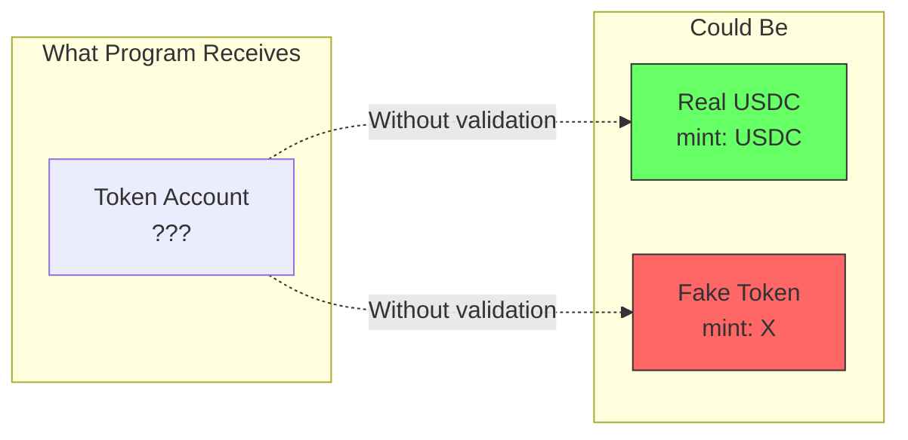

# Pattern 06: Token Validation

SPL Token integration vulnerabilities that enable token theft through missing validation checks.

## Vulnerability Description

SPL Token programs manage token accounts containing critical fields (mint, owner, authority) that **must be validated** by consuming programs. The SPL Token program itself doesn't know your business logic - it only executes the requested operations. Missing validation allows attackers to substitute accounts and exploit the gap between what your program expects and what it actually receives.

This pattern demonstrates three critical vulnerabilities:

| Vulnerability | Missing Check | Exploit |
|---------------|---------------|---------|
| **Mint Substitution** | `token.mint == expected_mint` | Deposit worthless tokens, withdraw valuable ones |
| **Owner Bypass** | `token.owner == expected_owner` | Redirect withdrawals to attacker accounts |
| **Authority Skip** | `caller == vault.authority` | Mint unlimited tokens without permission |

## Attack Scenario

### Visual: Token Account Relationships

Understanding why validation matters requires understanding token account structure:



Without mint validation, the program cannot distinguish valuable tokens from worthless substitutes.

### Scenario 1: Mint Substitution Attack (Deposit Exploit)

```
Attacker                          Vulnerable Program                    Vault
   |                                     |                                |
   |  1. Create worthless mint X         |                                |
   |  2. Mint 1000 X tokens              |                                |
   |                                     |                                |
   |  3. deposit(1000, X_token_account)  |                                |
   |------------------------------------>|                                |
   |                                     |  4. No mint validation!        |
   |                                     |  Accepts X instead of USDC     |
   |                                     |-------------------------------->|
   |                                     |  5. Credits attacker 1000      |
   |                                     |                                |
   |  6. withdraw(1000, USDC_account)    |                                |
   |------------------------------------>|                                |
   |                                     |  7. Sends real USDC            |
   |<------------------------------------|--------------------------------|
   |                                     |                                |
   |  Result: Worthless X -> Real USDC   |                                |
```

### Scenario 2: Owner Bypass Attack (Withdrawal Exploit)

```
Victim                  Attacker                    Vulnerable Program
   |                        |                              |
   |  1. deposit(1000)      |                              |
   |---------------------------------------------->|
   |                        |                              |
   |  2. withdraw(1000)     |                              |
   |  (provides correct destination)                       |
   |                        |                              |
   |                        |  3. Front-run: Call withdraw |
   |                        |  with ATTACKER's destination |
   |                        |----------------------------->|
   |                        |                              |
   |                        |  4. No owner validation!     |
   |                        |  Sends to attacker account   |
   |                        |<-----------------------------|
   |                        |                              |
   |  Result: Victim's funds stolen                        |
```

### Scenario 3: Authority Skip Attack (Mint Exploit)

```
Attacker                          Vulnerable Program                    Token Mint
   |                                     |                                |
   |  1. mint_reward(1_000_000_000)      |                                |
   |------------------------------------>|                                |
   |                                     |  2. No authority check!        |
   |                                     |  Anyone can trigger minting    |
   |                                     |-------------------------------->|
   |                                     |                                |
   |<------------------------------------|--------------------------------|
   |  3. Receives 1B tokens              |                                |
   |                                     |                                |
   |  Result: Unlimited token inflation  |                                |
```

## Vulnerable Implementation

**Location**: [`programs/vulnerable/src/lib.rs`](./programs/vulnerable/src/lib.rs)

The vulnerable implementation demonstrates all three attack vectors:

### Missing Mint Validation

```rust
// programs/vulnerable/src/lib.rs:338-362

#[derive(Accounts)]
pub struct Deposit<'info> {
    #[account(mut)]
    pub vault: Account<'info, Vault>,

    // VULNERABILITY: No mint constraint!
    // Should have: constraint = user_token_account.mint == vault.mint
    #[account(mut)]
    pub user_token_account: Account<'info, TokenAccount>,

    // ...
}
```

### Missing Owner Validation

```rust
// programs/vulnerable/src/lib.rs:389-426

#[derive(Accounts)]
pub struct Withdraw<'info> {
    // ...

    // VULNERABILITY: No owner constraint!
    // Should have: constraint = destination_token_account.owner == user.key()
    #[account(mut)]
    pub destination_token_account: Account<'info, TokenAccount>,

    // ...
}
```

### Missing Authority Check

```rust
// programs/vulnerable/src/lib.rs:436-466

#[derive(Accounts)]
pub struct MintReward<'info> {
    // No has_one = authority constraint!
    #[account(
        seeds = [VAULT_SEED, vault.mint.as_ref()],
        bump = vault.bump
    )]
    pub vault: Account<'info, Vault>,

    // VULNERABILITY: Any signer accepted
    pub anyone: Signer<'info>,  // Should be: authority: Signer + has_one

    // ...
}
```

## Secure Implementation

**Location**: [`programs/secure/src/lib.rs`](./programs/secure/src/lib.rs)

The secure implementation adds proper validation for each vulnerability:

### Mint Validation Added

```rust
// programs/secure/src/lib.rs:364-409

#[derive(Accounts)]
pub struct Deposit<'info> {
    #[account(mut)]
    pub vault: Account<'info, Vault>,

    // SECURITY: Mint validation ensures only correct token type accepted
    #[account(
        mut,
        constraint = user_token_account.mint == vault.mint @ TokenSecureError::MintMismatch
    )]
    pub user_token_account: Account<'info, TokenAccount>,

    // ...
}
```

### Owner Validation Added

```rust
// programs/secure/src/lib.rs:426-468

#[derive(Accounts)]
pub struct Withdraw<'info> {
    // ...

    // SECURITY: Owner AND mint validation
    #[account(
        mut,
        constraint = destination_token_account.owner == user.key() @ TokenSecureError::OwnerMismatch,
        constraint = destination_token_account.mint == vault.mint @ TokenSecureError::MintMismatch
    )]
    pub destination_token_account: Account<'info, TokenAccount>,

    // ...
}
```

### Authority Validation Added

```rust
// programs/secure/src/lib.rs:485-518

#[derive(Accounts)]
pub struct MintReward<'info> {
    // SECURITY: has_one ensures vault.authority == authority.key()
    #[account(
        seeds = [VAULT_SEED, vault.mint.as_ref()],
        bump = vault.bump,
        has_one = authority @ TokenSecureError::Unauthorized
    )]
    pub vault: Account<'info, Vault>,

    // SECURITY: Authority must sign
    pub authority: Signer<'info>,

    // ...
}
```

## Pinocchio Implementation

**Vulnerable**: [`pinocchio-programs/pinocchio-vulnerable/src/lib.rs`](./pinocchio-programs/pinocchio-vulnerable/src/lib.rs)

**Secure**: [`pinocchio-programs/pinocchio-secure/src/lib.rs`](./pinocchio-programs/pinocchio-secure/src/lib.rs)

Pinocchio requires manual byte parsing for token account validation:

### Manual Mint Parsing

```rust
// pinocchio-programs/pinocchio-secure/src/lib.rs

/// Parse mint from token account data (bytes 0-32)
fn parse_token_account_mint(data: &[u8]) -> Result<Address, ProgramError> {
    if data.len() < 32 {
        return Err(ProgramError::InvalidAccountData);
    }
    let mint_bytes: [u8; 32] = data[0..32].try_into()?;
    Ok(Address::new_from_array(mint_bytes))
}

// SECURITY: Validate mint in deposit
let user_token_data = user_token_account.try_borrow()?;
let user_token_mint = parse_token_account_mint(&user_token_data)?;
drop(user_token_data);

if user_token_mint.as_ref() != vault_state.mint.as_ref() {
    return Err(TokenSecureError::MintMismatch.into());
}
```

### Manual Owner Parsing

```rust
/// Parse owner from token account data (bytes 32-64)
fn parse_token_account_owner(data: &[u8]) -> Result<Address, ProgramError> {
    if data.len() < 64 {
        return Err(ProgramError::InvalidAccountData);
    }
    let owner_bytes: [u8; 32] = data[32..64].try_into()?;
    Ok(Address::new_from_array(owner_bytes))
}

// SECURITY: Validate owner in withdraw
let dest_data = destination_token_account.try_borrow()?;
let dest_owner = parse_token_account_owner(&dest_data)?;
drop(dest_data);

if dest_owner.as_ref() != user.address().as_ref() {
    return Err(TokenSecureError::OwnerMismatch.into());
}
```

For detailed framework comparison, see [docs/PINOCCHIO-COMPARISON.md](./docs/PINOCCHIO-COMPARISON.md).

## Framework Comparison: Anchor vs Pinocchio

This pattern is implemented in both Anchor and Pinocchio to demonstrate how token validation differs between high-level and low-level frameworks.

### Validation Approach Comparison

| Security Check | Anchor | Pinocchio |
|----------------|--------|-----------|
| **Mint validation** | `constraint = token.mint == vault.mint` | Parse bytes 0-32, compare addresses |
| **Owner validation** | `constraint = token.owner == user.key()` | Parse bytes 32-64, compare addresses |
| **Authority check** | `has_one = authority` + `Signer<'info>` | Manual compare + `is_signer()` |
| **Token transfer** | `token::transfer(ctx, amount)` | Manual 9-byte instruction construction |
| **PDA signing** | `CpiContext::new_with_signer(..., seeds)` | `Signer::from(seeds)` + `invoke_signed` |

### Code Complexity Comparison

| Metric | Anchor | Pinocchio |
|--------|--------|-----------|
| Vault account size | 113 bytes | 105 bytes (8 bytes smaller) |
| Deposit function LoC | ~25 lines | ~60 lines |
| Validation code | Declarative (in struct) | Imperative (in function) |
| Binary size overhead | ~100KB+ | ~5KB |

### Trade-offs

**Choose Anchor when:**
- Developer productivity is priority
- Team is less experienced with Solana internals
- IDL generation for clients is needed
- Declarative security is preferred

**Choose Pinocchio when:**
- Binary size constraints are critical
- Maximum control over instruction data needed
- Auditing requires explicit validation visibility
- CU optimization is necessary

### Side-by-Side: Mint Validation

**Anchor** - Declarative constraint in account struct:

```rust
#[account(
    mut,
    constraint = user_token_account.mint == vault.mint @ TokenError::MintMismatch
)]
pub user_token_account: Account<'info, TokenAccount>,
```

**Pinocchio** - Explicit parsing and comparison:

```rust
// Parse token account data to extract mint (bytes 0-32)
let token_data = user_token_account.try_borrow()?;
let mint_bytes: [u8; 32] = token_data[0..32].try_into()?;
let token_mint = Address::new_from_array(mint_bytes);
drop(token_data);

// Compare against expected mint
if token_mint.as_ref() != vault_state.mint.as_ref() {
    return Err(TokenError::MintMismatch.into());
}
```

**Security equivalence**: Both approaches provide identical security guarantees when implemented correctly. The difference is ergonomics, not protection level.

## Running Tests

### Prerequisites

```bash
# Ensure you're in the pattern directory
cd patterns/06-token-validation

# Install dependencies (if not already)
npm install
```

### Build Programs

```bash
# Build all programs (Anchor + Pinocchio)
anchor build
```

### Run Anchor Exploit Demo

```bash
# Run exploit demonstration for Anchor programs
npx ts-mocha -p ./tsconfig.json -t 1000000 tests/exploit-demo.ts
```

**Expected Output**:

```
Token Validation Pattern - Exploit Demo
  Vulnerable Program
    ✓ demonstrates mint substitution attack (deposit worthless tokens)
    ✓ demonstrates owner bypass attack (redirect withdrawal)
    ✓ demonstrates unauthorized minting (anyone can mint)
  Secure Program
    ✓ rejects deposit with wrong mint
    ✓ rejects withdrawal to wrong owner
    ✓ rejects minting from non-authority
    ✓ allows legitimate operations
```

### Run Pinocchio Exploit Demo

```bash
# Run exploit demonstration for Pinocchio programs
npx ts-mocha -p ./tsconfig.json -t 1000000 tests/pinocchio-exploit-demo.ts
```

### Run All Tests

```bash
# Run full test suite
anchor test
```

### Interpreting Test Results

| Test | Pass = | Fail = |
|------|--------|--------|
| Vulnerable exploit tests | Vulnerability exists (expected) | Vulnerability fixed (unexpected) |
| Secure rejection tests | Fix works (expected) | Fix broken (unexpected) |
| Legitimate operation tests | Program works (expected) | Bug in implementation |

## Key Takeaways

1. **Always validate token mint** - The SPL Token program doesn't know which token your program expects. Without mint validation, attackers substitute worthless tokens for valuable ones.

2. **Always validate token owner for withdrawals** - Without owner validation, attackers redirect funds to their accounts by passing their token account as the destination.

3. **Always require authority signature** - A pubkey alone can be passed by anyone. Use `has_one` (Anchor) or manual comparison + `is_signer()` (Pinocchio) to verify the caller is authorized.

4. **Pinocchio requires explicit validation** - Anchor's constraints make validation declarative. Pinocchio requires manual byte parsing, but the security requirements are identical.

5. **Test the exploits** - If you can't demonstrate the vulnerability in tests, you haven't proven it's fixed. Always write exploit tests for both vulnerable and secure implementations.

## Related Patterns

| Pattern | Relationship |
|---------|--------------|
| [Pattern 02: Authority Checks](../02-authority-checks/) | Authority validation fundamentals |
| [Pattern 05: PDA Derivation](../05-pda-derivation/) | PDA seeds used for vault derivation |
| [Pattern 03: Unsafe Arithmetic](../03-unsafe-arithmetic/) | Balance calculations need safe math |

## References

### Solana Documentation

- [SPL Token Program](https://spl.solana.com/token) - Official SPL Token documentation
- [Token Account Layout](https://github.com/solana-labs/solana-program-library/blob/master/token/program/src/state.rs) - Account data structures
- [Anchor Token Constraints](https://www.anchor-lang.com/docs/account-constraints) - Anchor's token validation

### Security Resources

- [Sealevel Attacks](https://github.com/coral-xyz/sealevel-attacks) - Solana vulnerability patterns
- [Neodyme Blog](https://blog.neodyme.io/) - Solana security research
- [Soteria Security](https://www.soteria.dev/) - Solana auditing tools

### Pattern Documentation

- [SPL Token Deep-Dive](./docs/SPL-TOKEN-DEEP-DIVE.md) - Token architecture fundamentals
- [Token Patterns Guide](./docs/TOKEN-PATTERNS.md) - Common token integration patterns
- [Pinocchio Comparison](./docs/PINOCCHIO-COMPARISON.md) - Framework comparison details
